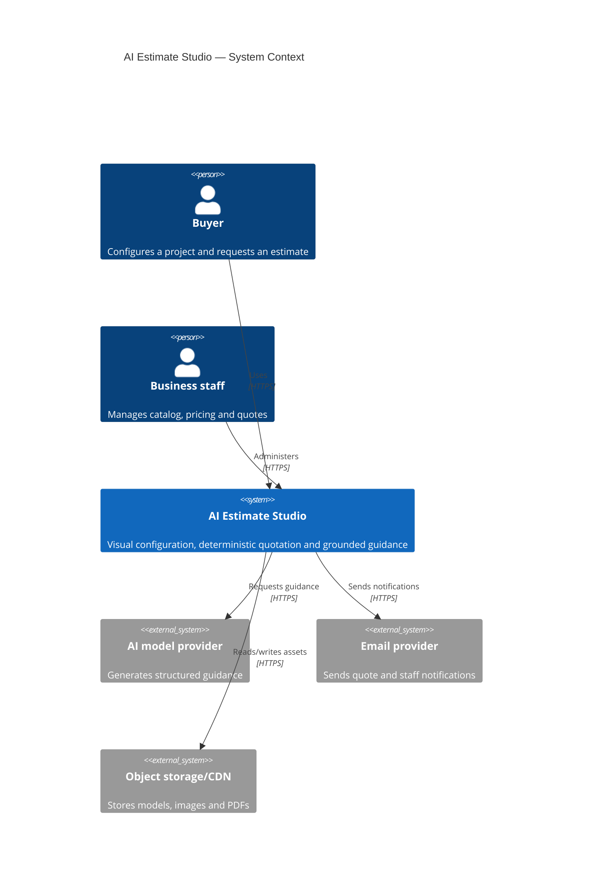
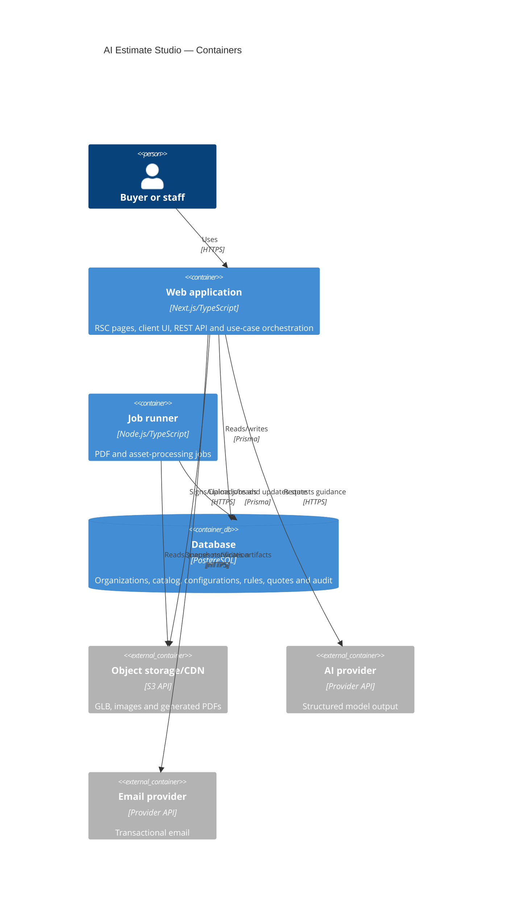
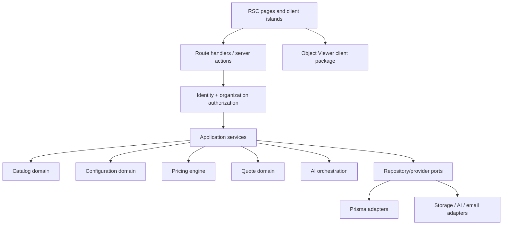
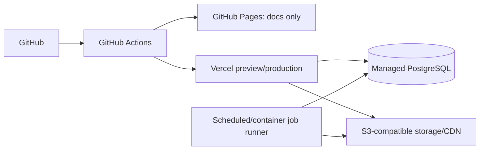

# C4 Architecture Model

## Level 1 — System context

```mermaid
C4Context
  title AI Estimate Studio — System Context
  Person(buyer, "Buyer", "Configures a project and requests an estimate")
  Person(staff, "Business staff", "Manages catalog, pricing and quotes")
  System(studio, "AI Estimate Studio", "Visual configuration, deterministic quotation and grounded guidance")
  System_Ext(ai, "AI model provider", "Generates structured guidance")
  System_Ext(mail, "Email provider", "Sends quote and staff notifications")
  System_Ext(storage, "Object storage/CDN", "Stores models, images and PDFs")
  Rel(buyer, studio, "Uses", "HTTPS")
  Rel(staff, studio, "Administers", "HTTPS")
  Rel(studio, ai, "Requests guidance", "HTTPS")
  Rel(studio, mail, "Sends notifications", "HTTPS")
  Rel(studio, storage, "Reads/writes assets", "HTTPS")
```

## Level 2 — Containers

```mermaid
C4Container
  title AI Estimate Studio — Containers
  Person(user, "Buyer or staff")
  Container(web, "Web application", "Next.js/TypeScript", "RSC pages, client UI, REST API and use-case orchestration")
  Container(worker, "Job runner", "Node.js/TypeScript", "PDF and asset-processing jobs")
  ContainerDb(db, "Database", "PostgreSQL", "Organizations, catalog, configurations, rules, quotes and audit")
  Container_Ext(objects, "Object storage/CDN", "S3 API", "GLB, images and generated PDFs")
  Container_Ext(provider, "AI provider", "Provider API", "Structured model output")
  Container_Ext(email, "Email provider", "Provider API", "Transactional email")
  Rel(user, web, "Uses", "HTTPS")
  Rel(web, db, "Reads/writes", "Prisma")
  Rel(web, objects, "Signs/uploads/reads", "HTTPS")
  Rel(web, provider, "Requests guidance", "HTTPS")
  Rel(web, email, "Queues notification", "HTTPS")
  Rel(worker, db, "Claims jobs and updates state", "Prisma")
  Rel(worker, objects, "Reads snapshots/writes artifacts", "HTTPS")
```

## Level 3 — Web application components

```mermaid
flowchart TB
  Pages["RSC pages and client islands"] --> Transport["Route handlers / server actions"]
  Transport --> Authz["Identity + organization authorization"]
  Authz --> App["Application services"]
  App --> Catalog["Catalog domain"]
  App --> Config["Configuration domain"]
  App --> Pricing["Pricing engine"]
  App --> Quote["Quote domain"]
  App --> AI["AI orchestration"]
  App --> Ports["Repository/provider ports"]
  Ports --> Prisma["Prisma adapters"]
  Ports --> External["Storage / AI / email adapters"]
  Pages --> Viewer["Object Viewer client package"]
```

## Deployment view

```mermaid
flowchart LR
  GitHub["GitHub"] --> Actions["GitHub Actions"]
  Actions --> Pages["GitHub Pages: docs only"]
  Actions --> Vercel["Vercel preview/production"]
  Vercel --> Postgres[("Managed PostgreSQL")]
  Vercel --> S3["S3-compatible storage/CDN"]
  Runner["Scheduled/container job runner"] --> Postgres
  Runner --> S3
```

