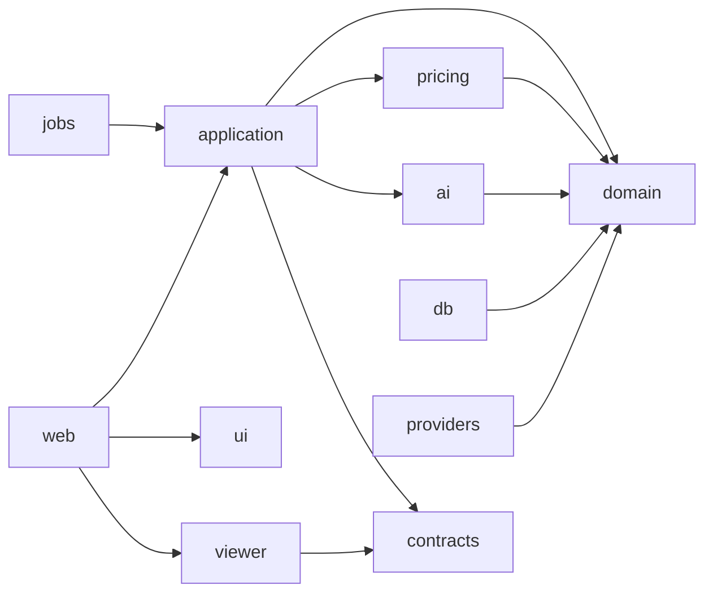

# Repository and Package Design

## Target structure after implementation approval

```text
.
├── apps/
│   ├── web/                    # Next.js public site, admin, route handlers
│   └── jobs/                   # PDF and asset-processing worker entry points
├── packages/
│   ├── domain/                 # Pure entities, value objects, policies, ports
│   ├── pricing-engine/         # Pure pricing DSL validation/evaluation
│   ├── viewer-engine/          # Generic Three.js runtime and React adapter
│   ├── application/            # Use cases and transaction boundaries
│   ├── db/                     # Prisma schema/client/repository adapters
│   ├── ai/                     # Provider-neutral recommendation orchestration
│   ├── ui/                     # Accessible shared components/tokens
│   ├── contracts/              # Zod DTOs generated/checked against OpenAPI
│   ├── providers/              # Storage, mail, auth, observability adapters
│   ├── config/                 # Shared lint, TypeScript, test config
│   └── testkit/                # Builders, fixtures, contract test harnesses
├── docs/                       # Normative design source of truth
├── .github/                    # CI, templates, ownership and policies
├── pnpm-workspace.yaml
└── turbo.json
```

No application directories are created during the design phase.

## Package boundaries



Allowed dependencies point inward. `domain` depends only on TypeScript standard facilities. `pricing-engine` is pure and receives time/context explicitly. `viewer-engine` has no business-domain imports. `db` and `providers` implement ports; application code depends on interfaces, not adapter classes.

## Component architecture

- Public feature folders: `features/catalog`, `features/configurator`, `features/quote`, `features/guidance`.
- Admin feature folders: `features/admin/catalog`, `pricing`, `assets`, `quotes`, `settings`, `audit`.
- A feature owns its route composition, view models, forms and tests. Cross-feature primitives move to `ui` only after demonstrated reuse.
- Server-only modules use an explicit server boundary and must not be re-exported from client package entry points.
- Viewer React adapter owns mount/dispose and bridges serializable viewer configuration to the imperative engine.

## Shared contracts

OpenAPI is the external contract. Zod schemas are the runtime contract used by routes, forms and application services. Prisma types do not leave `packages/db`; DTO mapping is explicit. Domain IDs use branded strings internally but serialize as UUID strings.

## Repository governance files

Implementation foundation creates `CODEOWNERS`, pull request template, issue templates, Dependabot/Renovate configuration, CI workflows, changeset configuration, editor settings and environment examples. Secrets and generated artifacts are ignored; `.env.example` contains names and descriptions only.

