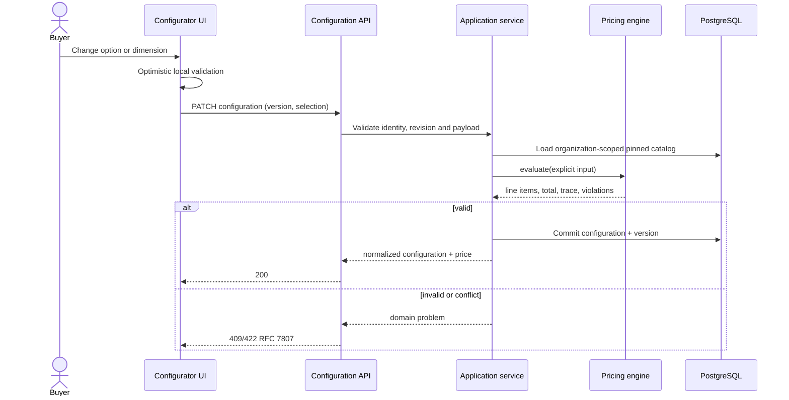
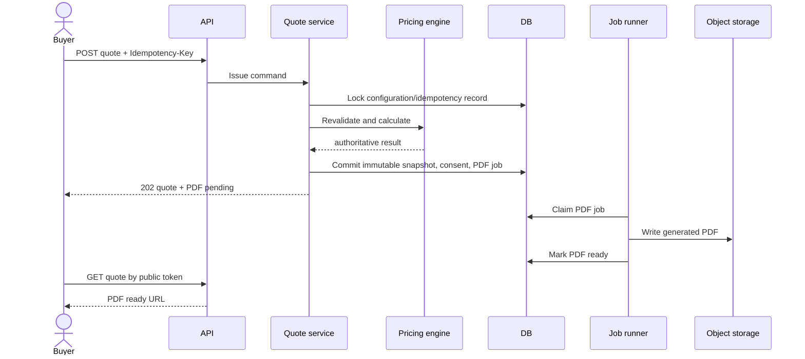
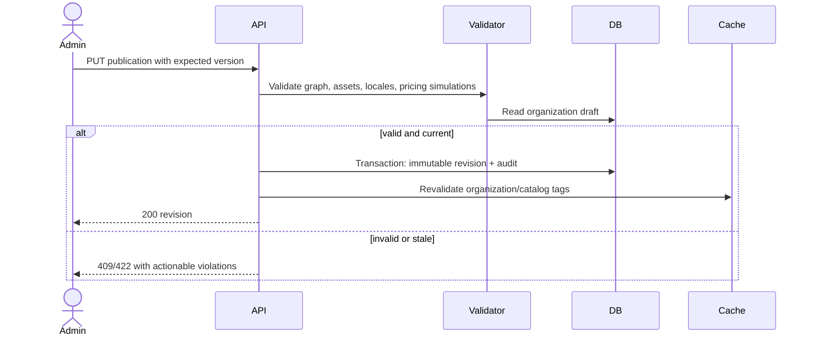

# Key Sequence Diagrams

## Configuration and repricing



## AI recommendation

```mermaid
sequenceDiagram
  actor Buyer
  participant API
  participant Context as Context builder
  participant AI as AI abstraction
  participant Provider
  participant Verify as Output verifier
  Buyer->>API: Request guidance with budget/goal
  API->>Context: Load allowlisted current snapshot
  Context-->>AI: bounded context + schema + prompt version
  AI->>Provider: structured generation
  Provider-->>AI: candidate JSON
  AI->>Verify: schema, entity IDs, compatibility, price claims
  alt verified
    Verify-->>API: recommendation
    API-->>Buyer: 201 structured guidance
  else invalid/timeout
    Verify-->>API: safe unavailable result
    API-->>Buyer: 422/503; quote flow unaffected
  end
```

## Quote issue and PDF



## Catalog publication



