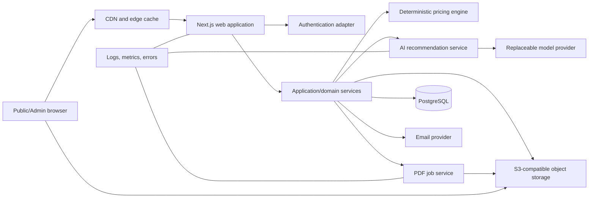

# System Architecture

**Status:** Proposed normative architecture  
**Pattern:** TypeScript modular monolith deployed as a Next.js application with separately invoked background jobs

## 1. Architectural drivers

- A small team must deliver one product without distributed-system overhead.
- Pricing and quote snapshots require relational integrity and deterministic domain code.
- Public pages require SEO and fast first render; the viewer is a client-only progressive enhancement.
- Vercel is the primary web target, while local and Docker execution must remain supported.
- AI, object storage, email and PDF rendering require provider boundaries.
- Organization data must be isolated at every query and authorization boundary.

## 2. Logical architecture

## 3. Runtime components

| Component | Responsibilities | Must not do |
|---|---|---|
| Web UI | routing, SSR/RSC, client interaction, accessibility | contain pricing or authorization truth |
| Route handlers | OpenAPI transport, validation, auth context, RFC 7807 mapping | query data without organization scope |
| Application services | use-case orchestration, transactions, idempotency, audit emission | depend on React/HTTP details |
| Domain | entities, policies, validation and value objects | perform I/O or import framework modules |
| Pricing engine | validate context, evaluate ordered rule DSL, produce trace/lines | call AI, database or wall clock implicitly |
| Viewer engine | render assets and configuration mappings, hotspots, lifecycle | know pools, pergolas, sheds, roofing or pricing |
| AI service | assemble approved context, invoke provider, validate structured output | mutate configuration or author totals |
| Data access | Prisma queries, tenant scope, transactions | return cross-organization records |
| Job service | PDF render, asset inspection/optimization, retries | process unbounded work in request lifecycle |
| Provider adapters | storage, AI, email, observability | leak vendor types into domain packages |

## 4. Request and data flow

1. The server resolves organization from the canonical host; no client-supplied organization ID is trusted.
2. Public catalog reads select published revisions and return cacheable DTOs.
3. Configuration mutations validate the pinned catalog revision and persist normalized selections.
4. Pricing receives an explicit immutable input including rule revision, currency, tax context and evaluation timestamp.
5. Quote issue runs configuration validation and pricing in one transaction, snapshots inputs/outputs, stores consent evidence, then enqueues PDF generation.
6. AI receives only an allowlisted projection of the current organization/catalog/configuration. Structured output is schema-validated and cited IDs are checked before storage/display.
7. Audit records are committed in the same transaction as privileged mutations.

## 5. State management strategy

| State | Owner | Mechanism |
|---|---|---|
| Catalog and public content | Server | RSC fetch + tagged cache/revalidation on publication |
| Auth/session/organization | Server | Auth.js session and server-derived organization context |
| Configuration draft | Server authoritative, client optimistic | persisted configuration API + Zustand client store |
| Price preview | Pricing service authoritative | debounced request; local engine permitted only with identical signed revision |
| Viewer camera/hover/load | Viewer instance | imperative internal state outside React render cycle |
| Forms | Component | React Hook Form + shared Zod schemas |
| Admin lists | URL + server | query parameters for shareable filters/pagination |
| Async job status | Server | resource polling with backoff; no realtime dependency in MVP |

Zustand stores only normalized IDs/values and transient UI state. It never stores Prisma records, secrets, prices as truth, or a Three.js scene graph.

## 6. Rendering strategy

- Landing, category and product pages: React Server Components with static generation or ISR per organization and publication tag.
- Configurator shell: server-rendered product/revision metadata; client island for mutable steps.
- Object Viewer: dynamically imported with SSR disabled; static poster and text controls exist in initial HTML.
- Admin: dynamic server rendering for authorization and fresh operational data; client islands for editors.
- API: Next.js route handlers under `/api/v1`; server actions may call the same application services but are not public contracts.
- PDF: background HTML-to-PDF render from an immutable quote snapshot, never from live catalog pages.

## 7. Failure modes and resilience

| Failure | User impact | Required behavior |
|---|---|---|
| PostgreSQL unavailable | reads/mutations unavailable | fail closed, correlation ID, no stale quote issue; alert |
| Object storage unavailable | model/PDF unavailable | configuration and pricing continue with fallback; retry jobs |
| AI provider timeout | no guidance | circuit-break after threshold, continue quote flow |
| PDF job failure | delayed download | quote remains issued; retry with capped exponential backoff |
| Email failure | notification delayed | quote remains accessible; retry independently |
| Model corrupt/unsupported | no 3D | static poster/text controls; admin asset rejected before publish |
| Pricing rule invalid | cannot publish/reprice | reject publication; issued snapshots remain intact |
| Concurrent admin edit | possible lost update | optimistic version check returns `409` with current revision |

## 8. Security boundaries

- Public browser is untrusted; all selections, prices, entity IDs and upload metadata are revalidated.
- Organization context is derived server-side and included in every unique/index/query strategy.
- Direct object uploads use short-lived signed URLs scoped to one organization, key, size and content type.
- Admin authorization is enforced in application services, not only UI/route middleware.
- Provider credentials exist only in server runtime; client bundles receive public configuration only.
- AI input/output is untrusted content and undergoes allowlisting, schema validation and reference verification.

## 9. Scalability path

MVP remains a modular monolith. Stateless web instances scale horizontally; PostgreSQL uses managed pooling; assets use CDN/object storage; long tasks are jobs. Extraction into services is justified only by measured independent scaling, reliability or team-ownership needs. Domain packages and provider ports preserve that option without introducing it early.

## 10. Architecture fitness rules

- Dependency tests reject imports from domain/pricing into apps, Prisma, React or provider adapters.
- Every data access operation requires an `organizationId` from trusted context unless the table is explicitly global.
- Every pricing result includes rule revision and trace.
- Every provider adapter passes a shared contract test suite.
- No category name appears in viewer-engine or pricing-engine source.

