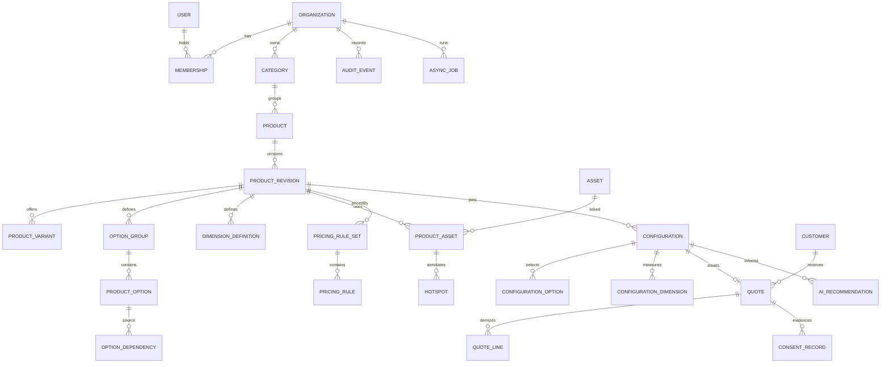
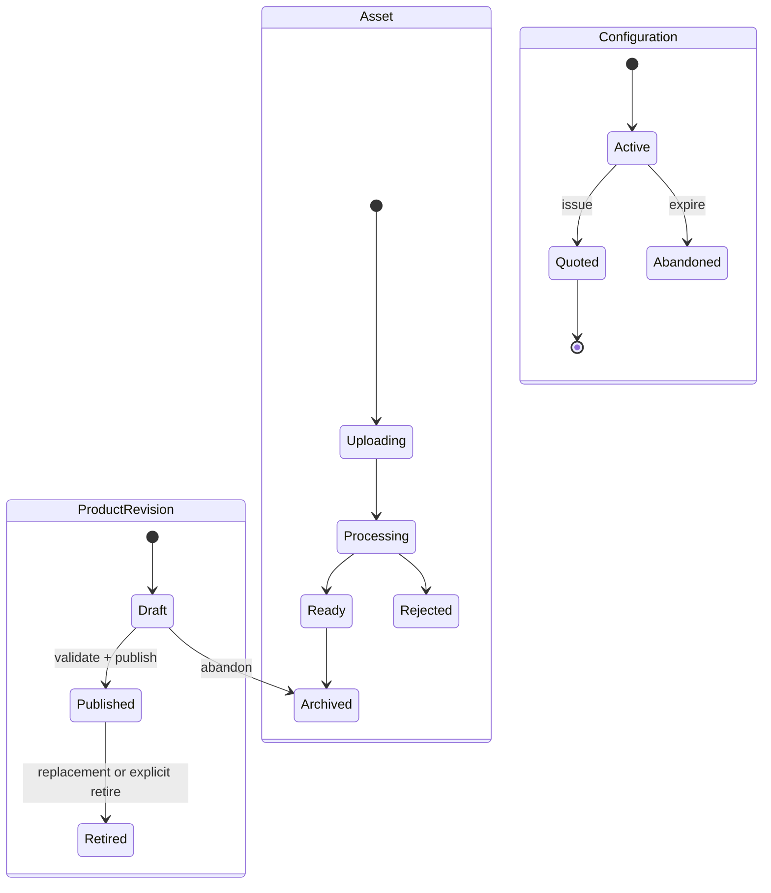

# Domain and Data Model

**Status:** Proposed normative model  
**Database:** PostgreSQL; all mutable business records are organization-scoped.

## 1. Modeling principles

- UUID primary keys; human-facing quote numbers are separate and unique per organization.
- Published product/pricing revisions and issued quote snapshots are immutable.
- Money is signed 64-bit integer minor units with an ISO 4217 currency code.
- Localized fields are validated JSON objects keyed by supported BCP 47 locale.
- Flexible JSON is limited to versioned, schema-validated rule, manifest, trace and snapshot payloads.
- Soft archive is preferred for referenced catalog data. Immutable quote/audit references prohibit destructive deletion.
- Every update uses optimistic concurrency (`version`) and every privileged mutation emits an audit event.

## 2. Entity relationship diagram

## 3. Core entity catalog

### Identity and tenancy

| Entity | Required fields and invariants |
|---|---|
| Organization | `id`, `slug`, legal/display names, default locale, supported locales, timezone, currency, quote validity, tax display mode, status, brand/legal configuration; canonical host unique globally |
| User | normalized unique email, display name, auth lifecycle timestamps; no organization-specific role |
| Membership | unique organization/user pair, role, status, invitation metadata; at least one active owner must remain |

### Catalog

| Entity | Required fields and invariants |
|---|---|
| Category | organization-scoped unique slug, localized name/description, sort order, status |
| Product | stable identity, category, organization-scoped unique slug, lifecycle state |
| ProductRevision | product, monotonically increasing revision, draft/published/retired state, localized content, publication window, default variant, viewer manifest version; only one active published revision at a time |
| ProductVariant | revision-scoped code, localized content, base price, currency, default flag, sort order; code unique within revision |
| OptionGroup | revision-scoped code, localized content, `SINGLE`/`MULTIPLE`, min/max selections, required flag, order |
| ProductOption | group-scoped code, localized content, state, order and optional viewer mapping key; price resides in rules, not this row |
| OptionDependency | source option, target option/variant, `REQUIRES` or `EXCLUDES`; cannot cross product revision; dependency graph must be cycle-safe |
| DimensionDefinition | revision-scoped code, localized label, unit, decimal min/max/step/default and required flag |

### Assets and viewer

| Entity | Required fields and invariants |
|---|---|
| Asset | organization, kind, storage key, MIME, size, SHA-256, width/height or 3D metadata, processing status, publication/access state; storage key and checksum immutable after ready |
| ProductAsset | product revision, asset, role (`MODEL`, `POSTER`, `GALLERY`, `DOCUMENT`), order, viewer manifest JSON; one primary model/poster per revision |
| Hotspot | product asset, stable code, localized label/detail, node mapping key, local position/normal, visibility condition, focus camera, order; unique code per product asset |

### Configuration and pricing

| Entity | Required fields and invariants |
|---|---|
| PricingRuleSet | product revision, revision number, currency, state, effective interval, schema version, checksum; published rows immutable |
| PricingRule | rule set, stable code, kind, priority, condition JSON, action JSON, stack policy, localized line label, tax class; unique code and deterministic priority |
| Configuration | organization, pinned product and pricing revisions, selected variant, locale, status, version, expiry, hashed session token and optional budget minor units |
| ConfigurationOption | unique configuration/option pair; option must belong to pinned revision |
| ConfigurationDimension | unique configuration/definition pair; normalized decimal value and unit must match definition |

### Customer, quote and AI

| Entity | Required fields and invariants |
|---|---|
| Customer | organization, normalized email, optional phone/name, locale, lifecycle/retention timestamps; duplicate emails may be merged only within an organization |
| Quote | organization, customer, configuration, quote number, status, currency, totals, issue/expiry, immutable configuration/pricing/catalog snapshots, rule trace checksum, public token hash and PDF asset reference |
| QuoteLine | quote, deterministic order, code, kind, localized label snapshot, quantity/units, unit amount, net amount, tax amount, total amount, tax class, source rule/entity IDs |
| ConsentRecord | customer/quote, purpose, status, policy version, timestamp, capture source and minimal evidence; withdrawal creates a new record |
| AIRecommendation | configuration, optional quote, prompt/model/provider identifiers, input hash, structured output, cited entity IDs, verification state, token/cost/latency metadata and retention expiry |
| AuditEvent | organization, actor or system identity, action, resource type/id, correlation ID, safe before/after summary, IP/user-agent hashes where justified, timestamp; append-only |
| AsyncJob | organization, type, status, deduplication key, attempts, availability/lock timestamps, safe payload and error code |

## 4. State transitions

## 5. Indexes and constraints

- Composite uniqueness always includes `organizationId` for organization-owned slugs/codes/numbers.
- Index public catalog by `(organizationId, state, publishedAt)` and product by `(categoryId, state)`.
- Index configurations by `(organizationId, expiresAt, status)` and quotes by `(organizationId, issuedAt desc)`, status, customer and quote number.
- Store only SHA-256 of public quote token; lookup uses indexed hash and checks expiry/revocation.
- AI input hashes are organization-scoped; cache reuse requires identical prompt version, model policy and approved context checksum.
- Partial/transactional constraints enforce one default variant and one active published revision through publication service plus database-supported uniqueness where Prisma migration SQL is required.

## 6. Retention

- Active/issued quote and consent retention defaults to 7 years but is organization-configurable subject to law.
- Abandoned configurations: 30 days; anonymous AI recommendations: 30 days; raw provider request/response is not retained beyond operational need.
- Audit events: minimum 2 years; asset/job operational logs: 90 days.
- Customer deletion anonymizes identity where quote retention is legally required; immutable financial snapshot fields remain without reusable public token.

## 7. Invariants enforced by application and database

- No selection/reference can cross organization or pinned product revision.
- Published revisions cannot be updated; replacement creates a new revision.
- Quote totals equal the ordered sum of stored quote lines and match snapshot checksum.
- Quote issue accepts a configuration once per idempotency key; repeated requests return the same quote.
- A public token never grants access to customer history or admin resources.
- Pricing and AI records store their exact schema/prompt/model versions.
