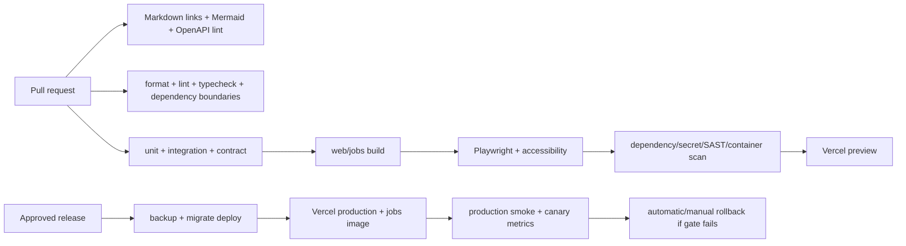

# Deployment and Environment Strategy

> **Current public deployment:** GitHub Pages is the primary host for the Mobup proof-of-realization. The application is exported statically, uses local assets and browser storage, and generates the indicative PDF client-side. Vercel, Docker and the server stack remain documented for the future platform edition and are not required to view or demonstrate the Mobup slice.

**Status:** Proposed normative strategy

## 1. Environments

| Environment | Purpose | Data/dependencies | Deployment trigger |
|---|---|---|---|
| Local | developer feedback | Docker PostgreSQL, MinIO, Mailpit; fake AI by default | manual |
| CI | deterministic verification | ephemeral PostgreSQL/MinIO, mocked providers | pull request/push |
| Preview | product review per PR | isolated preview DB schema/database and storage prefix; sandbox providers | Vercel PR deployment after CI |
| Staging | release candidate, migrations, E2E | production-like managed dependencies; synthetic data only | merge to `develop` or release candidate |
| Production | customer traffic | managed PostgreSQL, private object storage/CDN, approved AI/email | approved release from `main` |

Production data must never be copied into preview/local. Environment variables are schema-validated at process start. Secrets are stored in deployment secret managers, never `.env`, GitHub logs, docs, fixtures or client bundles.

## 2. Local development design

Implementation will provide:

- Node.js active LTS pinned in `.nvmrc`/Volta and `packageManager` pinned to pnpm.
- `docker-compose.yml` for PostgreSQL, MinIO and Mailpit with health checks and named volumes.
- `.env.example` documenting required names, safe defaults and provider modes.
- Commands: dependency install, infrastructure start, migration deploy, seed synthetic organization/catalog, web/job dev, tests and cleanup.
- Default `AI_PROVIDER=fake`, deterministic canned recommendations and local object URLs.

Fresh-clone setup must complete in ≤15 minutes on supported Windows/macOS/Linux Docker environments and be verified by an automated bootstrap smoke script.

## 3. Docker

- Multi-stage, non-root Node image with pinned digest; separate `web` and `jobs` targets from the same workspace.
- Build uses lockfile frozen install, prunes dev dependencies and produces Next.js standalone output.
- Runtime filesystem is read-only except `/tmp`; health check verifies process only, readiness verifies required database connectivity separately.
- Compose supports production-like web/jobs/PostgreSQL/MinIO wiring for portability, but self-hosted production is supported only after an operations review.
- Images are tagged with semantic version and immutable commit SHA, scanned before registry publication, and produce an SBOM/provenance attestation.

## 4. Vercel

- `apps/web` is the Vercel project root; Node runtime is used for Prisma, auth, AI and quote endpoints that cannot run safely at the edge.
- Public static/RSC content uses CDN/ISR; publication triggers signed on-demand revalidation by organization/product tags.
- Build does not execute production migrations. A protected deployment job runs `prisma migrate deploy` once before traffic promotion.
- Pooled `DATABASE_URL` serves runtime; `DIRECT_DATABASE_URL` is migration-only.
- Object storage, job runner and email remain external provider adapters. Vercel functions may enqueue jobs but do not execute long PDF/asset work synchronously.
- Preview deployments receive sandbox provider credentials and isolated data scope.

## 5. GitHub Actions pipeline

Workflows use least-privilege `permissions`, OIDC where supported, pinned action SHAs and concurrency cancellation for superseded PR builds. Production environment requires approval and records deploy actor/SHA.

## 6. GitHub Pages documentation

The Pages artifact contains the Mobup application at the site root and the VitePress engineering documentation under `/docs/`. The workflow must build with `STATIC_EXPORT=true`, set `NEXT_PUBLIC_BASE_PATH=/ai-estimate-studio`, preserve `.nojekyll`, and fail if the app entrypoint or critical local assets are absent. No secret, customer data or API endpoint is required for the public demo.

The interactive proof URL is `https://tobiags.github.io/ai-estimate-studio/` after the Pages workflow completes. The docs workflow remains documentation-only at `https://tobiags.github.io/ai-estimate-studio/docs/`; it validates internal links, Mermaid syntax, headings and OpenAPI before publishing the engineering reference from `main`.

The static demo stores only a validated configuration in browser storage and creates its indicative PDF locally. It must not bundle, proxy or host customer data, provider keys or server-generated quote artifacts. Rollback is a Pages redeploy of the last known-good commit (workflow dispatch or revert on `develop`/`main`); because the demo is stateless, no database migration or data rollback is needed. A failed artifact check blocks deployment.

## 7. Database migration and rollback

- Migrations are forward-only, reviewed SQL generated from the approved Prisma change and tested against a production-size synthetic snapshot.
- Use expand/migrate/contract for breaking changes. Application code remains compatible with old/new schema during rollout.
- Before production migration: verify backup freshness and restore test, estimate lock time, document abort criteria.
- Application rollback uses previous immutable image/deployment. Database rollback uses a prepared compensating migration or restore only when data loss is explicitly accepted; destructive automatic down migrations are prohibited.

## 8. Jobs

PostgreSQL-backed jobs are sufficient for MVP. Workers claim rows using transaction-safe skipping/leases, heartbeat long tasks, retry capped exponential backoff with jitter, and move exhausted work to `DEAD`. PDF generation, asset processing, email and privacy exports use idempotent deduplication keys. A scheduled recovery releases expired locks.

## 9. Observability

- OpenTelemetry-compatible traces/correlation IDs across HTTP, database, providers and jobs.
- Structured JSON logs with environment, service, release, organization ID (not name), request/job ID and safe error code.
- Metrics: request rate/errors/latency, DB pool, job age/failures, quote issue, PDF readiness, asset processing, AI latency/token/cost, web vitals and viewer fallback.
- Alerts: quote issue failure >2%/10 min, pricing invariant failure immediately, job oldest age >15 min, DB saturation, AI cost threshold, production error spike and failed backup.
- Error reporting redacts tokens, cookies, contact data, prompts, signed URLs and provider payloads.

## 10. Availability, backup and disaster recovery

- Managed PostgreSQL daily backup plus point-in-time recovery where available; object storage versioning/lifecycle for published assets/PDFs.
- RPO 24 h maximum, RTO 4 h. Quarterly restore rehearsal into an isolated environment records duration and integrity checks.
- Single-region MVP is acceptable at 99.9% target; documented provider region and data residency must match privacy policy.
- Runbooks cover database outage, storage outage, compromised credential, invalid pricing publication, stuck jobs and provider outage.

## 11. Production release checklist

All CI gates pass; roadmap acceptance evidence is linked; migrations and rollback reviewed; backups/restores healthy; environment schema valid; preview/staging smoke passed; security/accessibility approvals complete; no P0/P1 issue; dashboards/alerts active; release notes and docs updated. Post-deploy smoke verifies public catalog, configuration/reprice, quote issue/PDF, admin authentication and tenant isolation without using real customer data.
