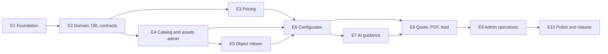

# AI Estimate Studio Implementation Roadmap

> **For agentic workers:** REQUIRED SUB-SKILL: Use `superpowers:subagent-driven-development` (recommended) or `superpowers:executing-plans` to implement this roadmap task-by-task. Steps use checkbox syntax for tracking.

**Status:** Approved by the product owner on 2026-08-05; execution is tracked task by task on `develop`.  
**Goal:** Deliver a production-grade multi-organization visual quotation platform whose pricing is deterministic and whose AI/viewer capabilities degrade safely.  
**Architecture:** TypeScript modular monolith in a pnpm/Turborepo workspace, Next.js web app, Node job runner, PostgreSQL/Prisma, S3-compatible assets, provider-neutral AI and contract-first REST API.  
**Tech stack:** Node active LTS, pnpm, Turborepo, Next.js, React, Tailwind, shadcn/ui, Three.js/React Three Fiber adapter, Prisma/PostgreSQL, Zod, Vercel AI SDK, Vitest, Playwright, Testcontainers, OpenAPI 3.1.

---

## Delivery rules

- Implement in the order below. A task starts only when all dependency IDs are complete.
- Each task is a small pull request or a reviewable sequence of TDD commits; a task is not complete until its listed tests and completion criteria pass.
- Exact target paths below are the intended structure. Creating application files before roadmap approval is prohibited.
- Every PR links requirement/acceptance IDs, updates normative docs where behavior changes and includes rollback/security/accessibility impact.

## Dependency overview

## Epic 1 — Engineering Foundation (original Epic 1)

### FND-01 — Workspace scaffold

- [x] **Objective:** Create the pnpm/Turborepo workspace and empty bounded package/app entry points without feature logic.
- **Dependencies:** Documentation/roadmap approval.
- **Files:** create `package.json`, `pnpm-workspace.yaml`, `turbo.json`, `.nvmrc`, `.editorconfig`, `.gitignore`, `apps/web/package.json`, `apps/jobs/package.json`, and package manifests under `packages/{domain,application,contracts,db,pricing-engine,viewer-engine,ai,ui,providers,config,testkit}/package.json`.
- **Expected tests:** frozen install, workspace graph, `turbo run build --dry`, dependency-boundary smoke.
- **Completion:** clean clone installs reproducibly; every workspace resolves; no cyclic dependency; no feature code.

### FND-02 — Shared static configuration

- [x] **Objective:** Enforce strict TypeScript, ESLint, Prettier, Vitest and environment conventions.
- **Dependencies:** FND-01.
- **Files:** create `packages/config/{typescript,eslint,vitest}/*`, root `eslint.config.*`, `prettier.config.*`, `apps/web/tsconfig.json`, `apps/jobs/tsconfig.json`, package `tsconfig.json` files, `.env.example`.
- **Expected tests:** deliberately invalid fixture fails each boundary/strictness rule; formatting check; environment-schema unit tests.
- **Completion:** `format:check`, `lint`, `typecheck` and test discovery pass on all packages with zero warning.

### FND-03 — Next.js and job-runner shells

- [x] **Objective:** Provide buildable health-only web/job processes and server/client boundary protection.
- **Dependencies:** FND-02.
- **Files:** create `apps/web/{next.config.ts,app/layout.tsx,app/page.tsx,app/api/health/route.ts}`, `apps/jobs/src/main.ts`, shared runtime config in `packages/config/src/env.ts`.
- **Expected tests:** health route contract, missing-env startup failure, web/jobs production builds, client bundle secret-import rejection.
- **Completion:** processes start and stop cleanly; health returns only status/release; no business functionality.

### FND-04 — Local infrastructure and synthetic seed

- [x] **Objective:** Make PostgreSQL, MinIO and Mailpit available consistently for local/CI.
- **Dependencies:** FND-03.
- **Files:** create `docker-compose.yml`, `docker/`, `scripts/bootstrap.*`, `packages/testkit/src/seed/`, update `.env.example` and root README.
- **Expected tests:** bootstrap from empty Docker volumes, service health, seed idempotency, teardown/restart persistence.
- **Completion:** fresh-clone documented setup ≤15 minutes and synthetic data only.

### FND-05 — CI, repository governance and documentation site

- [ ] **Objective:** Protect branches and run documentation/static/build/test/security checks with GitHub Pages docs deployment.
- **Dependencies:** FND-02.
- **Files:** create `.github/workflows/{ci,docs,security}.yml`, `CODEOWNERS`, PR/issue templates, dependency update config, `docs` site configuration.
- **Expected tests:** workflow lint, Markdown links/Mermaid/OpenAPI validation, least-permission check, Pages artifact inspection.
- **Completion:** required PR checks are deterministic; Pages contains docs only; actions are SHA-pinned.
- **Current evidence:** workflow/action lint, least-permission review, dependency audit and Pages artifact checks pass locally; remote activation and branch-protection verification require an explicit push/configuration step.

## Epic 2 — Domain, Database, Tenancy and Contracts

### DOM-01 — Pure domain primitives

- [x] **Objective:** Define branded IDs, money, locale, revision, state machines, errors and repository/provider ports without I/O.
- **Dependencies:** FND-02.
- **Files:** create focused modules under `packages/domain/src/{shared,organization,catalog,configuration,quote,customer,audit,jobs}/` and `packages/domain/src/index.ts`.
- **Expected tests:** money bounds, state transitions, version conflicts, ID/value validation and forbidden-import architecture tests.
- **Completion:** package has no React/Next/Prisma/provider imports; public API is documented and mutation-free where required.
- **Evidence (2026-08-05):** `packages/domain` exports immutable value objects, lifecycle transitions, organization-scoped repository/provider ports and entity snapshots. Package tests (13 assertions), typecheck, lint and forbidden-import architecture test pass; package README documents the boundary.

### DOM-02 — Prisma schema and initial migration

- [x] **Objective:** Translate the approved Prisma design and database-only constraints exactly.
- **Dependencies:** DOM-01, FND-04.
- **Files:** create `packages/db/prisma/schema.prisma`, `packages/db/prisma/migrations/*`, `packages/db/src/client.ts`, migration test fixtures.
- **Expected tests:** Prisma validate/format, migrate empty/current DB, constraint failures, schema drift and rollback rehearsal on synthetic snapshot.
- **Completion:** PostgreSQL schema matches the ER/model document; migrations are reviewed, forward-only and repeatable.
- **Evidence (2026-08-05):** Prisma 6.19.3 schema validates and formats; generated `0001_init` plus hardened `0002_constraints` apply cleanly to an empty local PostgreSQL database and replay with no pending migrations. Schema artifact tests cover all normative aggregates/enums and database-only checks; Prisma Client generation, package typecheck/lint and migration deploy pass.

### DOM-03 — Tenant-scoped repositories and transactions

- [x] **Objective:** Implement domain ports with mandatory trusted organization scope and transaction support.
- **Dependencies:** DOM-02.
- **Files:** create `packages/db/src/repositories/*`, `packages/db/src/transaction.ts`, `packages/db/src/mappers/*`.
- **Expected tests:** two-tenant CRUD/list matrix, transaction rollback, pagination, immutable published/quote records and optimistic version conflict.
- **Completion:** no adapter method can query organization-owned data without scope; Prisma types never leave `db`.
- **Evidence (2026-08-05):** `PrismaCatalogRepository` scopes category/product/revision reads and writes by organization, maps Prisma records to domain snapshots, validates pagination and performs atomic optimistic-version updates. `PrismaTransactionPort` uses serializable transactions. Integration tests cover tenant isolation, duplicate tenant-local slugs, rollback and stale-version rejection (3 tests pass with local PostgreSQL); DB lint/typecheck pass and Prisma types remain inside `packages/db`.

### DOM-04 — Staff authentication and RBAC

- [x] **Objective:** Integrate Auth.js identity, membership resolution, CSRF and service-level permission policies.
- **Dependencies:** DOM-03, FND-03.
- **Files:** create `apps/web/src/auth/*`, `packages/application/src/auth/*`, `packages/domain/src/organization/permissions.ts`, auth routes/middleware.
- **Expected tests:** session creation/rotation/revocation, every role/action, cross-host organization, CSRF/origin, last-owner rule and direct route denial.
- **Completion:** admin access is deny-by-default and organization-scoped; Owner/Admin production MFA requirement is documented/configurable through provider.
- **Evidence (2026-08-05):** Domain permission policy matches the Admin matrix, denies by default and protects the last active owner; application authorization requires an active same-organization membership, session expiry/rotation/revocation ports and constant-time double-submit CSRF/origin checks. Web route guard is server-only. Permission/session/CSRF tests (19 assertions across domain/application), lint and typecheck pass. Auth.js remains behind these ports so the provider can be configured without leaking framework types into domain/application.

### DOM-05 — OpenAPI-derived contracts and HTTP foundation

- [x] **Objective:** Establish runtime Zod DTOs, RFC 7807 mapping, pagination, idempotency and route harness matching OpenAPI.
- **Dependencies:** DOM-01, FND-03.
- **Files:** create `packages/contracts/src/*`, `apps/web/src/http/{problems,pagination,idempotency,route}.ts`, contract generation/validation scripts.
- **Expected tests:** OpenAPI lint/diff, examples validate, RFC 7807 content type, unsafe JSON/content limits, idempotency replay and Prism mock smoke.
- **Completion:** contracts contain no Prisma types; all documented status/error patterns are reusable and tested.
- **Evidence (2026-08-05):** `packages/contracts` exports runtime-validated primitives plus public catalog, configuration and quote DTOs, with strict request objects, bounded identifiers, integer minor amounts and RFC 3339 dates. Web HTTP helpers provide RFC 7807 responses, correlation IDs, bounded JSON parsing, cursor/limit envelopes and scoped idempotency replay/conflict behavior. Contract and HTTP tests pass (10 assertions), OpenAPI lint passes, and no contract module imports Prisma or provider types.

## Epic 3 — Deterministic Pricing Engine (original Epic 4)

### PRC-01 — Rule schema and money arithmetic

- [x] **Objective:** Define validated rule AST, typed facts/actions, integer money and explicit rounding.
- **Dependencies:** DOM-01.
- **Files:** create `packages/pricing-engine/src/{money,decimal,rule-schema,facts,errors}.ts` and builders in `packages/testkit/src/pricing/`.
- **Expected tests:** half-away rounding, overflow/bounds, every AST node, invalid/unknown fields and serialized schema golden files.
- **Completion:** no floating-point monetary operation; schema rejects executable/unbounded constructs.
- **Evidence (2026-08-05):** `packages/pricing-engine` provides signed-64-bit integer money, currency-safe arithmetic, rational multiplication and explicit half-away/half-even/floor/ceiling rounding. Its Zod rule AST allowlists fact paths and action types, bounds condition depth/JSON size/rate magnitude, rejects duplicate rule codes and exposes typed facts without I/O. Pricing tests (6 tests), package lint/typecheck and build pass.

### PRC-02 — Configuration and rule-set validation

- [x] **Objective:** Validate option cardinality/dependencies, dimensions, tiers, stack groups, references and effective intervals.
- **Dependencies:** PRC-01, DOM-01.
- **Files:** create `packages/pricing-engine/src/validation/*` and property-test generators.
- **Expected tests:** cycles, impossible groups, overlapping tiers, cross-revision IDs, boundary dimensions, randomized graph/formula fuzz cases.
- **Completion:** every publication-blocking condition in the pricing spec has a stable code and test.
- **Evidence (2026-08-05):** Pricing validation now returns stable publication-blocking issue codes for impossible selection groups, cross-revision references, dependency cycles/self-links, decimal dimension bounds/steps/defaults, overlapping tiers and exclusive stack conflicts. It is pure, bounded and deterministic; validation tests cover valid input, graph cycles, interval overlap, decimal boundaries and 32 generated small graphs (11 tests pass).

### PRC-03 — Staged evaluator and trace

- [x] **Objective:** Evaluate base/options/dimensions/labor/delivery/fees deterministically with stable line ordering/trace.
- **Dependencies:** PRC-02.
- **Files:** create `packages/pricing-engine/src/evaluator/*`, `packages/pricing-engine/src/trace.ts`.
- **Expected tests:** golden scenarios, randomized input ordering determinism, applied/skipped trace and checksum equivalence.
- **Completion:** pure function has no I/O/implicit time; repeated identical explicit inputs are byte-equivalent.
- **Evidence (2026-08-05):** The pure evaluator sorts rules by priority/code, evaluates allowlisted conditions and emits immutable line items plus applied/skipped trace entries. Integer percentage actions use explicit half-away rounding; totals and a canonical serialization are returned without clock, database or provider access. Golden, ordering-equivalence and trace tests pass (14 pricing tests total).

### PRC-04 — Discounts and taxes

- [x] **Objective:** Implement stack policies, caps, tax classes and inclusive/exclusive rounding/allocation.
- **Dependencies:** PRC-03.
- **Files:** create `packages/pricing-engine/src/stages/{discounts,taxes}.ts` and jurisdiction-neutral fixtures.
- **Expected tests:** discount eligibility/stacking/caps, zero floor, inclusive/exclusive taxes, per-class/per-line policy and all rounding boundaries.
- **Completion:** line sums equal stored totals for all property tests; no negative final total.
- **Evidence (2026-08-05):** Discount and tax stages are pure, integer-only functions. Discounts support deterministic priority/order, stack groups, best-only/exclusive selection and subtotal/cap floors. Taxes support class rates, inclusive/exclusive calculation, per-line rounding and total exclusive allocation while preserving line sums. Stage tests cover caps, stacking, inclusive tax and allocation (19 pricing tests total).

### PRC-05 — Pricing application services and simulations

- [ ] **Objective:** Persist draft rule sets, run mandatory scenario suites and publish immutable revisions atomically.
- **Dependencies:** PRC-04, DOM-03, DOM-05.
- **Files:** create `packages/application/src/pricing/*`, pricing repository adapter, API routes under `apps/web/app/api/v1/admin/pricing-rule-sets/`.
- **Expected tests:** draft update/version conflict, simulation trace, failed scenario blocks publication, one active revision, audit/cache event after commit.
- **Completion:** OpenAPI pricing endpoints pass contract tests; publication evidence is retained.
- **Evidence (2026-08-05, persistence adapter):** `packages/db/src/repositories/pricing.ts` now maps bounded rule documents, enforces organization scope, replaces draft rules transactionally with optimistic versions, and retires prior published revisions before publishing the selected set. Repository tests cover scoped reads and transactional draft replacement; HTTP route contract wiring and audit/cache integration remain in the next PRC-05 slice.

## Epic 4 — Catalog, Asset and Publication Administration (original Epic 7 part 1)

### CAT-01 — Catalog application services and public projections

- [ ] **Objective:** Implement category/product revision lifecycle and published locale-aware projections.
- **Dependencies:** DOM-03, DOM-05.
- **Files:** create `packages/application/src/catalog/*`, `packages/db/src/repositories/catalog*.ts`, public/admin route trees under `apps/web/app/api/v1/`.
- **Expected tests:** draft/publish/retire transitions, locale fallback, publication window, pagination/cache ETags and tenant isolation.
- **Completion:** public endpoints expose only current published data and conform to OpenAPI.

### CAT-02 — Product revision aggregate editor service

- [ ] **Objective:** Save/validate complete variants, dimensions, groups/options, dependencies and asset usages as one versioned aggregate.
- **Dependencies:** CAT-01, PRC-02.
- **Files:** create `packages/application/src/catalog/product-revision-service.ts`, validators/mappers and product-revision routes.
- **Expected tests:** child add/update/remove, cross-revision rejection, stable IDs, stale aggregate conflict, published revision immutability.
- **Completion:** one transaction creates a normalized aggregate and actionable validation list.

### CAT-03 — Asset upload and processing pipeline

- [ ] **Objective:** Provide signed upload, checksum verification, secure processing metadata and immutable storage keys.
- **Dependencies:** DOM-03, FND-04.
- **Files:** create `packages/providers/src/storage/*`, `packages/application/src/assets/*`, `apps/jobs/src/jobs/process-asset.ts`, asset API routes.
- **Expected tests:** provider contract, signed constraint expiry, MIME/signature mismatch, size/model budgets, malformed/external URI model, duplicate completion idempotency and retries.
- **Completion:** only `READY` safe assets can publish; failures have stable non-sensitive codes.

### CAT-04 — Catalog/admin UI

- [ ] **Objective:** Build accessible category/product/revision editors with localization, dependency table and validation summary.
- **Dependencies:** CAT-02, DOM-04, package `ui` foundation from FND-02.
- **Files:** create `apps/web/app/admin/catalog/**`, `apps/web/src/features/admin/catalog/**`, shared components under `packages/ui/src/` only when reused.
- **Expected tests:** role rendering and direct denial, form states, dirty-navigation guard, keyboard/screen reader, version conflict and responsive views.
- **Completion:** Catalog Editor can produce a valid draft but cannot publish; Admin/Owner can review.

### CAT-05 — Publication orchestration

- [ ] **Objective:** Combine catalog, asset, viewer-manifest and pricing validations into atomic publish/retire operations.
- **Dependencies:** CAT-02, CAT-03, PRC-05.
- **Files:** create `packages/application/src/catalog/publication-service.ts`, publication routes and cache adapters.
- **Expected tests:** each gate failure, concurrent publication, effective window, revision immutability, audit and post-commit cache revalidation.
- **Completion:** a revision becomes publicly visible atomically only after all normative gates pass.

## Epic 5 — Generic Object Viewer (original Epic 2)

### VWR-01 — Manifest and capability contracts

- [x] **Objective:** Implement generic viewer manifest/configuration schemas and publication validator without business terminology.
- **Dependencies:** DOM-05, CAT-03.
- **Files:** create `packages/viewer-engine/src/contracts/*`, `packages/contracts/src/viewer/*`, asset validation integration.
- **Expected tests:** schema versions, node/action/hotspot references, conflicts, unsupported capabilities and category-term architecture scan.
- **Completion:** manifests are serializable/versioned and invalid manifests block publication.
- **Evidence (2026-08-05):** `packages/contracts/src/viewer/manifest.ts` defines a versioned, strict object-viewer manifest with asset, node, hotspot, action and capability contracts. `viewer-engine` validates duplicate IDs/mappings, node references and capability requirements with stable publication issue codes. Tests cover valid manifests, invalid references, missing capabilities and strict unknown-field rejection (3 viewer tests pass); no domain-specific terminology or models are imported.

### VWR-02 — Asset manager and scene runtime

- [ ] **Objective:** Implement GLTF loading/normalization, decoders, bounded cache, renderer/scene/camera lifecycle and full disposal.
- **Dependencies:** VWR-01.
- **Files:** create `packages/viewer-engine/src/{assets,scene,camera,lifecycle}/**` plus minimal licensed synthetic GLB fixtures.
- **Expected tests:** load/progress/cancel/replace, bounds framing, context loss, cache eviction, disposal of geometry/material/texture/mixer/listeners/frames.
- **Completion:** 20-switch memory benchmark meets ≤15% settled growth; no reference code/assets copied.

### VWR-03 — Configuration mapping and hotspots

- [ ] **Objective:** Apply idempotent node/material/transform/clip actions and accessible 3D annotations.
- **Dependencies:** VWR-02.
- **Files:** create `packages/viewer-engine/src/{mapping,hotspots,interaction}/**`.
- **Expected tests:** condition diffs, conflicts, missing optional mapping, screen-space picking, anchor/callout sync, keyboard and occlusion behavior.
- **Completion:** viewer state derives only from generic configuration; price/domain packages are not dependencies.

### VWR-04 — React adapter and fallback

- [ ] **Objective:** Mount/dispose the imperative engine in a lazy client island with poster/text fallback and reduced motion.
- **Dependencies:** VWR-03.
- **Files:** create `packages/viewer-engine/src/react/ObjectViewer.tsx`, `apps/web/src/features/configurator/viewer/*`.
- **Expected tests:** mount/unmount/prop replacement, SSR exclusion, failure fallback, hotspot DOM parity, focus, touch/keyboard and reduced motion.
- **Completion:** configuration remains operable when viewer chunk/model/WebGL fails.

### VWR-05 — Admin viewer editor and performance gate

- [ ] **Objective:** Author node mappings/hotspots/camera/capabilities and enforce asset/runtime budgets.
- **Dependencies:** VWR-04, CAT-04.
- **Files:** create `apps/web/src/features/admin/viewer/**`, viewer benchmark and Playwright fixtures.
- **Expected tests:** keyboard coordinate editor, draft preview, invalid node/hotspot, bundle/model/frame/memory budgets and responsive screenshots.
- **Completion:** a generic synthetic object can be authored, previewed and published with no domain-specific code.

## Epic 6 — Public Configurator (original Epic 3)

### CFG-01 — Configuration lifecycle and secure session

- [ ] **Objective:** Create/read/update expiring server configurations pinned to catalog/pricing revisions and secure cookie binding.
- **Dependencies:** CAT-05, PRC-05, DOM-05.
- **Files:** create `packages/application/src/configuration/*`, repository adapters and configuration routes.
- **Expected tests:** create defaults, complete-set updates, dependency/dimension rejection, version conflict, session binding/expiry, reprice and tenant isolation.
- **Completion:** every successful mutation returns normalized state and authoritative price.

### CFG-02 — Public discovery pages

- [ ] **Objective:** Build localized SSR/ISR landing, category and product pages with non-JS content and starting-price integrity.
- **Dependencies:** CAT-01.
- **Files:** create `apps/web/app/[locale]/{page.tsx,categories/**,products/**}`, `apps/web/src/features/catalog/**`.
- **Expected tests:** SEO metadata/structured content, cache revalidation, locale fallback, no-products state, 320–1440 responsive and JS-disabled flow to configurator start.
- **Completion:** published catalog is discoverable and meaningful without viewer/JavaScript.

### CFG-03 — Step engine, client store and forms

- [ ] **Objective:** Render data-driven steps, option/dimension controls and recoverable optimistic state.
- **Dependencies:** CFG-01, CFG-02.
- **Files:** create `apps/web/app/[locale]/configure/[id]/page.tsx`, `apps/web/src/features/configurator/{store,steps,forms,summary}/**`.
- **Expected tests:** step ordering, cardinality, dependency reveal/removal confirmation, validation focus, session reload, French expansion and mobile sticky total.
- **Completion:** all four categories use data only; no category branch in UI logic.

### CFG-04 — Live pricing, viewer synchronization and degradation

- [ ] **Objective:** Synchronize normalized selections with authoritative price and generic viewer while preserving recoverable states.
- **Dependencies:** CFG-03, VWR-04.
- **Files:** create configurator pricing/viewer adapters and state components under `apps/web/src/features/configurator/`.
- **Expected tests:** provisional/updating/server truth, out-of-order response cancellation, price mismatch, model failure, offline/retry, live region and Undo after verified suggestion.
- **Completion:** price line/total and viewer reflect the same returned configuration version; viewer failure never blocks Next.

### CFG-05 — Configurator end-to-end and performance

- [ ] **Objective:** Prove the critical configuration journey across devices, accessibility modes and representative product fixtures.
- **Dependencies:** CFG-04.
- **Files:** create `apps/web/e2e/configurator/*.spec.ts`, performance fixtures/configuration.
- **Expected tests:** four category golden paths, keyboard/screen reader smoke, reduced motion, WebGL absent, stale update, dependency conflict, Core Web Vitals/bundle budgets.
- **Completion:** AC-001 partial, AC-002/003/004/011/012 evidence passes.

## Epic 7 — Grounded AI Guidance (original Epic 5)

### AIG-01 — AI port, policy and prompt registry

- [x] **Objective:** Implement provider-neutral structured generation contracts and versioned prompt/policy registry.
- **Dependencies:** DOM-05, CFG-01.
- **Files:** create `packages/ai/src/{ports,policy,prompts,schemas}/**` and provider contract tests.
- **Expected tests:** prompt snapshot/version, schema limits, adapter error mapping, timeout/abort and no vendor type leakage.
- **Completion:** fake adapter passes the same contract as production adapter; no customer PII is accepted by the port.
- **Evidence (2026-08-05):** `packages/ai` defines a vendor-neutral structured provider port, strict recommendation output schema, versioned prompt registry and bounded no-PII policy. Fake-provider tests exercise schema parity, prompt versioning, provider error mapping, prompt size limits and contact-data rejection (3 AI tests pass); no provider SDK types enter the package boundary.

### AIG-02 — Allowlisted context builder

- [x] **Objective:** Build bounded same-revision context and deterministic alternative candidates with server price deltas.
- **Dependencies:** AIG-01, PRC-04, CAT-01.
- **Files:** create `packages/ai/src/context/*`, `packages/application/src/ai/context-service.ts`.
- **Expected tests:** tenant/revision isolation, token/candidate truncation, locale, no-PII projection, budget ranking and catalog/user injection delimiters.
- **Completion:** snapshot/checksum proves exactly what approved context was supplied.
- **Evidence (2026-08-05):** `packages/ai/src/context` provides canonical, bounded same-revision context and budget-ranked alternatives; `packages/application/src/ai/context-service.ts` requires tenant-scoped retrieval and locale/revision inputs before building the snapshot. Tests cover tenant/revision forwarding and isolation, deterministic checksum, truncation, delimiters and contact-data rejection (AI context and application suites pass).

### AIG-03 — Provider adapter and verification pipeline

- [x] **Objective:** Call configured provider, validate output, verify references/selections and recompute price deltas before storage.
- **Dependencies:** AIG-02.
- **Files:** create `packages/providers/src/ai/*`, `packages/ai/src/verify/*`, `packages/application/src/ai/recommendation-service.ts`, recommendation route.
- **Expected tests:** malformed JSON, invented/cross-tenant IDs, invalid combination, delta mismatch, prompt leakage, provider outage/rate/cost limits and cache safety.
- **Completion:** only `VERIFIED` suggestions reach public response; failure leaves quote flow intact.
- **Evidence (2026-08-05):** `packages/providers/src/ai/json-provider.ts` provides a vendor-neutral JSON transport adapter with prompt/output/cost bounds and mapped provider failures. `packages/ai/src/verify` validates every referenced entity, rejects invalid combinations, recomputes deltas/currency and returns only verified suggestions. `packages/application/src/ai/recommendation-service.ts` enforces tenant/configuration scope and persists only non-empty verified results through a port; `apps/web/src/http/recommendation.ts` maps failures to RFC 7807 and exposes no unverified output. AI, provider, application and HTTP suites cover malformed JSON, unknown IDs, delta mismatch, rate/cost/PII controls and rejection (all pass). Concrete provider transport and Prisma store remain replaceable adapters behind these ports.

### AIG-04 — Guidance UI and evaluation gate

- [ ] **Objective:** Add accessible guidance sheet/apply/undo and frozen bilingual evaluation suite.
- **Dependencies:** AIG-03, CFG-04.
- **Files:** create `apps/web/src/features/guidance/**`, `packages/ai/evals/{cases,rubrics,baselines}/**`, CI evaluation workflow.
- **Expected tests:** loading/empty/error, apply verified IDs only, keyboard/mobile, 120+ evaluation cases and thresholds in AI spec.
- **Completion:** AC-005/006 and all AI release metrics pass for approved model/prompt pair.

## Epic 8 — Quote, PDF and Lead Capture (original Epic 6)

### QTE-01 — Customer, consent and atomic quote issue

- [ ] **Objective:** Revalidate/reprice and atomically create immutable customer/consent/quote snapshots with token/idempotency.
- **Dependencies:** CFG-05, AIG-03, DOM-03.
- **Files:** create `packages/application/src/quote/{issue,consent,token}.ts`, quote/customer repositories and issue route.
- **Expected tests:** consent requirements, normalized customer, stale config, duplicate idempotency, token hash/entropy/expiry, snapshot immutability and concurrent issue.
- **Completion:** issued lines/totals/snapshots/checksum are transactionally consistent and future publications cannot alter them.

### QTE-02 — PDF renderer and job

- [ ] **Objective:** Generate tagged branded PDF from quote snapshot only and store it idempotently.
- **Dependencies:** QTE-01, CAT-03.
- **Files:** create `apps/jobs/src/jobs/generate-quote-pdf.ts`, `packages/application/src/quote/pdf/*`, PDF template/tests.
- **Expected tests:** bilingual golden text, line/totals, assumptions/exclusions, AI label, tagging/reading order, retry/deduplication and storage outage.
- **Completion:** PDF checksum/content remains stable for fixed snapshot/runtime; p95 budget and accessibility checks pass.

### QTE-03 — Review, confirmation and public quote

- [ ] **Objective:** Build contact/consent review, issue states, tokenized quote reopening and PDF download/polling.
- **Dependencies:** QTE-01, QTE-02.
- **Files:** create `apps/web/app/[locale]/{review,quote}/**`, `apps/web/src/features/quote/**`, public quote/PDF routes.
- **Expected tests:** validation preservation, double-submit, pending/failed/ready PDF, expired/revoked token, referrer/log redaction, keyboard/mobile/PDF action.
- **Completion:** AC-001/007 and anonymous end-to-end quote journey pass.

### QTE-04 — Transactional notification

- [ ] **Objective:** Send customer/staff quote notifications asynchronously without coupling issuance to email availability.
- **Dependencies:** QTE-01, FND-04.
- **Files:** create `packages/providers/src/email/*`, `apps/jobs/src/jobs/send-quote-email.ts`, localized templates.
- **Expected tests:** provider contract, safe links, localization, retry/deduplication, bounce-safe error and no secrets/PII in logs.
- **Completion:** quote issue succeeds during mail outage; eventual status is observable/retryable.

### QTE-05 — Quote journey release tests

- [ ] **Objective:** Exercise failure, privacy, determinism and accessibility of the whole buyer journey.
- **Dependencies:** QTE-03, QTE-04.
- **Files:** create `apps/web/e2e/quote/*.spec.ts`, restore/load/security scenarios.
- **Expected tests:** AC-001–008/011 as applicable, provider fault injection, load at target concurrency, public token abuse and snapshot comparison.
- **Completion:** no P0/P1 defect; quote success ≥99.5% in target load test.

## Epic 9 — Administration Operations (original Epic 7 part 2)

### ADM-01 — Quotes and customers

- [ ] **Objective:** Build role-scoped searchable quote/customer lists, immutable details and allowed status/contact transitions.
- **Dependencies:** QTE-05, DOM-04.
- **Files:** create admin API handlers/services and `apps/web/app/admin/{quotes,customers}/**`.
- **Expected tests:** filters/cursors/export, RBAC, snapshot display, transitions, identity correction/version conflict and tenant isolation.
- **Completion:** Sales can follow up without catalog/settings access; immutable fields cannot be edited.

### ADM-02 — Organization and membership settings

- [ ] **Objective:** Build brand/localization/quote/legal settings and safe user invitation/role/suspension.
- **Dependencies:** DOM-04, QTE-03.
- **Files:** create organization/membership services/routes and `apps/web/app/admin/settings/**`.
- **Expected tests:** Owner-only settings, contrast/locale/currency locks, invite lifecycle, session revocation, self/last-owner rules and audit.
- **Completion:** permissions exactly match Admin spec and AC-009.

### ADM-03 — Dashboard, audit, jobs and privacy requests

- [ ] **Objective:** Provide operational metrics, immutable audit search/export, job retry and customer export/anonymization workflows.
- **Dependencies:** ADM-01, ADM-02.
- **Files:** create `apps/web/app/admin/{page.tsx,audit,jobs}/**`, application services/job handlers for privacy, audit and dashboard projections.
- **Expected tests:** timezone ranges, metric definitions, audit immutability/export event, retry eligibility/lease, retention/anonymization and required-role denial.
- **Completion:** operations can diagnose/recover without direct database access; privacy evidence is retained.

### ADM-04 — Complete admin accessibility and concurrency pass

- [ ] **Objective:** Validate all admin screens, states and simultaneous edits across roles/devices.
- **Dependencies:** CAT-04, VWR-05, PRC-05, ADM-03.
- **Files:** create `apps/web/e2e/admin/**`, accessibility/visual baselines.
- **Expected tests:** every role matrix cell, dirty guard, conflict resolution, empty/loading/error, 320/768/1440, keyboard/screen reader and 200% zoom.
- **Completion:** Admin acceptance criteria and AC-009/010/011 pass.

## Epic 10 — Polish, Hardening, Demo and Release (original Epic 8)

### REL-01 — Localization and content completion

- [ ] **Objective:** Complete English/French UI, organization-supplied legal content, error catalog and PDF/email content with 130% expansion tolerance.
- **Dependencies:** ADM-04.
- **Files:** update locale resources across `apps/web`, templates and organization seed content; add missing-key tooling.
- **Expected tests:** no missing keys, pseudo-localization, date/money/unit/timezone formats and content review.
- **Completion:** all public/admin states are bilingual and plain-language reviewed.

### REL-02 — Accessibility and performance remediation

- [ ] **Objective:** Meet all WCAG and performance budgets using release-candidate data/assets.
- **Dependencies:** REL-01.
- **Files:** targeted feature/style/config changes only, Lighthouse/bundle/viewer benchmark configuration and evidence.
- **Expected tests:** full manual accessibility protocol, PDF audit, Lighthouse CI, RUM smoke, viewer frame/memory and API k6 load.
- **Completion:** zero critical/serious accessibility issue and all normative budgets pass or have approved time-bound exception.

### REL-03 — Security, privacy and disaster-recovery validation

- [ ] **Objective:** Complete threat-model verification, scans, tenant matrix, penetration scope, retention and restore/rotation drills.
- **Dependencies:** REL-02.
- **Files:** update security runbooks/evidence, retention/privacy jobs, headers/provider policies and infrastructure configuration.
- **Expected tests:** ASVS checklist, SAST/dependency/secret/container/DAST, upload/AI abuse, two-tenant matrix, backup restore and credential rotation.
- **Completion:** security owner approves; no exploitable critical/high; RPO/RTO drill passes.

### REL-04 — Staging, Docker, Vercel and GitHub Pages release path

- [ ] **Objective:** Prove reproducible images, preview/staging migration, Vercel production promotion, job runner and docs-only Pages.
- **Dependencies:** REL-03, FND-05.
- **Files:** finalize `Dockerfile`, deployment workflows/config, migration/rollback/smoke scripts and runbooks.
- **Expected tests:** SBOM/image scan, fresh deploy, expand/contract migration, rollback, provider outage, Pages artifact and production smoke in staging.
- **Completion:** release/rollback can be executed from immutable SHA with recorded approver and active alerts.

### REL-05 — Portfolio demo and MVP release gate

- [ ] **Objective:** Seed a reviewed generic demonstration across supported categories, record the documented demo flow and decide release.
- **Dependencies:** REL-04.
- **Files:** create/update synthetic demo seed, `docs/demo/DEMO_SCRIPT.md`, release notes and final traceability matrix.
- **Expected tests:** complete scripted landing → product → configure → AI → price → PDF → contact flow; all AC-001–012 and success-metric instrumentation.
- **Completion:** Product, Architecture, Security, Accessibility and Operations sign off; tag `1.0.0`; no P0/P1; roadmap evidence complete.

## Milestones and approval checkpoints

| Milestone | Included | Demonstrable outcome | Approval |
|---|---|---|---|
| M0 | FND-01–FND-05 | governed reproducible workspace, no product feature | Architecture/Platform |
| M1 | DOM + PRC | tenant-safe domain/data/API foundation and deterministic pricing | Architecture/Pricing |
| M2 | CAT + VWR | admin-authored generic published product and viewer | Product/3D/Accessibility |
| M3 | CFG | complete priceable configuration without AI/PDF | Product/Quality |
| M4 | AIG + QTE | verified guidance and immutable PDF quote journey | Product/Security/AI |
| M5 | ADM + REL | production operations, hardening and release | All owners |

## Explicitly deferred after MVP

Payments, financing, CRM synchronization, CAD/AR, customer accounts, collaborative editing, multi-currency conversion, vector retrieval, autonomous AI tools, realtime push, multi-region active-active and microservice extraction. Each requires a new approved product/design spec and ADR where applicable.
