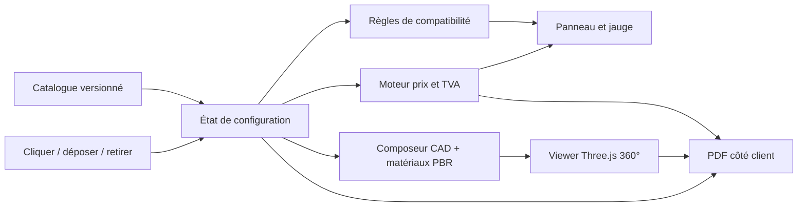

# Refonte : configurateur 3D de studio de jardin Mobup

## Statut

Approuvé en atelier de conception le 12 août 2026, sous réserve de la revue de cette spécification. Cette spécification remplace, pour le démonstrateur public, le prototype Pergola / Pool / Landscape. Aucun élément de ce dernier ne doit rester visible dans la nouvelle expérience.

## Décision produit

Le produit public est un configurateur direct de studio de jardin modulaire. Il montre immédiatement une composition 3D réaliste et orbitable. Le visiteur compose une façade, voit les contraintes et le prix changer en direct, puis télécharge une estimation PDF sans créer de compte ni suivre un parcours à étapes.

La première configuration affichée au chargement est `P4 + M1 + M8 + Claustra` : une façade de 5,00 m qui reprend l'esprit de la référence fournie. Elle sert de preuve de réalisation; elle n'est pas une promesse de disponibilité fabricant.

## Objectifs et limites

### Objectifs

- Donner un résultat visuel complet dès le premier affichage.
- Permettre une vue 360 degrés : orbite, zoom, recentrage et inspection de la façade.
- Composer la façade par clic ou glisser-déposer, sans assistant séquentiel.
- Refuser immédiatement tout module qui dépasse la largeur disponible.
- Calculer une estimation HT, TVA et TTC de manière déterministe.
- Générer localement un PDF de demande d'estimation en français ou en anglais.
- Être exportable sur GitHub Pages sans serveur, API payante, clé secrète ni collecte de données distante.

### Hors périmètre de la première version

- Paiement, compte client, CRM, e-mail transactionnel, inventaire ou prix contractuels.
- Génération 3D à la demande depuis une image dans le navigateur.
- Plans de permis, calculs structurels ou validation de conformité bâtiment.
- Configurateur de pergola, piscine, aménagement paysager ou autre catégorie.

## Utilisateur cible et scénario

Un prospect ouvre un lien partagé par un prestataire. Il voit un studio de jardin 3D déjà monté, le tourne librement, modifie quelques éléments de façade, consulte l'estimation et télécharge son PDF. Il n'a ni à apprendre une interface, ni à donner son e-mail pour accéder au résultat.

## Expérience et interface

### Composition de l'écran

- Grand canevas 3D à gauche sur écran large; panneau compact à droite.
- Panneau sous le canevas sur mobile, sans masquer durablement la scène.
- En-tête minimal : `Mobup Studio`, libellé `Configurateur architectural 3D`, sélecteur FR / EN.
- Le panneau contient la base, le tiroir de modules, les accessoires, la jauge de largeur, le total et l'action PDF.
- Aucun carrousel décoratif, bandeau animé, contour vert, image de fond plaquée sur la scène, ni navigation vers une autre catégorie.

### Contrôles 3D

- Glisser : rotation libre autour du studio.
- Molette ou pincement : zoom borné.
- Bouton de recentrage : retour à la caméra de présentation.
- Bouton `Analyse` : bascule une couche sobre de cotes, identifiants de modules, dimensions globales, matériaux et détail du prix. Elle est désactivée par défaut.
- Le clavier conserve un accès aux contrôles essentiels; l'utilisateur qui préfère réduire les animations ne reçoit pas d'animation de module.

### Langue et typographie

- Français et anglais sont des traductions complètes de la même configuration, y compris le PDF.
- Police unique : Montserrat. Graisse 600 ou 700 pour les titres et commandes; 400 ou 500 pour les informations.
- Palette : blanc cassé, gris minéral, noir graphite, bois chaud et accent terre cuite réservé aux montants et états actifs. Le vert est exclu.

## Scène 3D et réalisme

La rotation doit rester honnête : tout élément visible dans la scène est un maillage 3D, pas un panorama ou une photographie de fond donnant une illusion de relief.

### Structure paramétrique

- Dalle, toit, cadres, murs, ouvertures et claustra sont construits comme éléments CAD paramétriques.
- La largeur de façade vient de la base choisie; la profondeur est fixe à 3,00 m; la hauteur des murs est fixe à 2,80 m.
- Chaque ajout ou retrait reconstruit les seuls groupes de scène concernés et met à jour les cotes.

### Matériaux et lumière retenus

- Bardage : cèdre thermo-traité, lames verticales, finition mate et chaude.
- Toiture : toit plat gris graphite mat.
- Cadres : aluminium anthracite mat.
- Baies : vitrage clair avec réflexions environnementales discrètes.
- Sol : matériau PBR minéral local; accessoires : GLB PBR locaux et optimisés.
- Éclairage : lumière de jour claire, ombres douces et environnement neutre.

### Usage des images générées

Les images générées pourront alimenter la planche de direction artistique, les visuels de partage et la sélection de références. Elles ne remplacent jamais la structure tournable. Les textures et modèles de production doivent avoir une licence compatible, une source enregistrée et une taille adaptée au web.

## Catalogue initial

Les dimensions suivantes sont la transposition des documents source. Les prix sont des valeurs de démonstration, hors taxe et non contractuelles.

| Famille | Identifiant | Largeur | Prix HT |
| --- | --- | ---: | ---: |
| Base | P1 | 1,25 m | 1 150 EUR |
| Base | P2 | 2,50 m | 1 890 EUR |
| Base | P3 | 3,75 m | 2 590 EUR |
| Base | P4 | 5,00 m | 3 290 EUR |
| Mur | M1 | 1,25 m | 690 EUR |
| Mur | M2 | 0,50 m | 390 EUR |
| Mur | M3 | 0,70 m | 520 EUR |
| Mur | M4 | 0,90 m | 590 EUR |
| Mur | M5 | 0,90 m | 590 EUR |
| Mur | M6 | 0,90 m | 590 EUR |
| Mur | M7 | 2,50 m | 1 790 EUR |
| Mur | M8 | 3,75 m | 2 490 EUR |
| Mur | M9 | 2,50 m | 1 790 EUR |
| Mur | M10 | 3,75 m | 1 990 EUR |
| Accessoire | Bandeau C1 | 0,80 m visuel | 390 EUR |
| Accessoire | Claustra | 1,25 m visuel | 490 EUR |

Les bases déterminent la largeur maximale. Les murs consomment cette largeur. C1 et Claustra ajoutent un prix mais pas de largeur; ils exigent une cible compatible. La TVA de démonstration vaut 20 %, est exposée dans le catalogue et doit rester configurable par marché.

Les documents ne donnent pas de nom commercial ou de fonction sans ambiguïté pour M2-M6 et M9. La première version conserve leur identifiant, leur largeur et la silhouette d'ouverture visible sur le schéma. Les appellations commerciales et actifs définitifs restent une mise à jour de catalogue, non un changement de moteur.

## Règles de configuration et prix

1. Une seule base est active.
2. La somme des largeurs de murs ne dépasse jamais la largeur de la base.
3. Un module qui ne tient pas est désactivé dans le catalogue et refusé au dépôt.
4. L'ordre des murs est conservé; le glisser-déposer ne peut déposer qu'à une frontière de module valide.
5. Le retrait, le déplacement et l'annulation mettent à jour scène, largeur, analyse et prix dans la même transaction d'état.
6. Le prix HT est la somme de la base, des murs et accessoires. La TVA est arrondie au centime une seule fois sur ce total. Le TTC est HT plus TVA.
7. Livraison, pose, permis et raccordements sont explicitement exclus du total de démonstration et listés dans le PDF comme à confirmer.

## Architecture applicative

### Paquets et responsabilités

- `domain` : identifiants, catalogue, configuration, règles de largeur et types de modules.
- `pricing-engine` : calcul HT, TVA, TTC et lignes d'estimation; aucune dépendance à React ou Three.js.
- `application` : cas d'usage ajouter, déplacer, retirer, changer de langue et préparer le PDF.
- `web` : interface, accessibilité, état de présentation, viewer Three.js, chargeurs d'actifs et export PDF.
- `assets` : manifest des GLB, textures PBR, licences, poids et variantes de qualité.

Le catalogue est une donnée versionnée, validée au chargement. La configuration est sérialisable, stockée dans `localStorage` pour reprise locale et encodée dans l'URL seulement si son volume reste sûr. GitHub Pages n'héberge aucune donnée personnelle ni secret.

## PDF d'estimation

Le PDF est produit dans le navigateur. Il contient : nom du projet, date, langue, coordonnées saisies, tableau des modules, dimensions, estimation HT, TVA, TTC, éléments exclus, durée de validité indicative et vignette de la scène. La collecte d'adresse et de contact est facultative; un PDF peut être produit sans ces champs. Le fichier indique sur chaque page qu'il s'agit d'une estimation non contractuelle.

## États, erreurs et accessibilité

- Chargement : squelette du panneau et aperçu 3D progressif; la configuration reste utilisable quand les actifs non critiques arrivent.
- Actif manquant : structure CAD et matériaux de secours neutres, avec message discret; jamais un canevas vide.
- Module incompatible : carte désactivée, explication de la largeur restante et aucune mutation d'état.
- Échec PDF : conservation de la configuration et action de réessai; aucune perte de données.
- WebGL indisponible : vue isométrique statique et panneau de configuration/panier fonctionnels.
- Les commandes ont un nom accessible, un état visible au clavier, un contraste suffisant et ne reposent pas seulement sur la couleur.

## Exigences de performance et vérification

- Chargement différé des accessoires hors configuration initiale.
- Budget initial de scènes et textures contrôlé par manifeste; pas de modèle haute définition chargé sans besoin.
- Test unitaire : règles de largeur, ordre, compatibilité, prix, TVA et sérialisation.
- Test composant : messages d'incompatibilité, changement FR/EN et mode Analyse.
- Test navigateur : orbite, zoom, recentrage, ajout, retrait, dépôt, état mobile et export PDF.
- Test visuel : absence de chevauchement, absence de décoration verte, lisibilité de Montserrat et vue 3D rendue sur navigateur courant.
- Build statique, lint, formatage, typecheck et tests doivent réussir avant chaque déploiement GitHub Pages.

## Critères d'acceptation de la refonte

1. La page d'accueil n'affiche que le studio de jardin modulaire.
2. La scène initiale est visible, réaliste et peut être orbitée, zoomée et réinitialisée.
3. P1-P4, M1-M10, C1 et Claustra existent dans le catalogue avec les dimensions de cette spécification.
4. Une combinaison trop large est impossible par clic et par dépôt.
5. Les montants HT, TVA et TTC correspondent exactement au catalogue actif et sont signalés non contractuels.
6. FR/EN affecte l'interface et le PDF.
7. Le PDF est créé sans service externe et inclut les mentions prévues.
8. La version exportée est consultable sur GitHub Pages et ne contient pas de clé ou donnée personnelle de démonstration.

## Décisions reportées

- Noms commerciaux définitifs, géométrie de fabrication précise et prix fabricant des modules M2-M6 et M9.
- Variantes de bardage, couleur, isolation, électricité, plomberie, livraison et pose.
- Serveur de capture de prospects, CRM et devis contractuel.

Ces éléments étendent le catalogue ou les intégrations; ils ne doivent pas remettre en cause le modèle de configuration validé ici.
