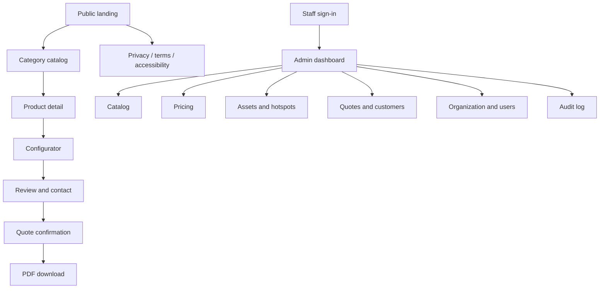
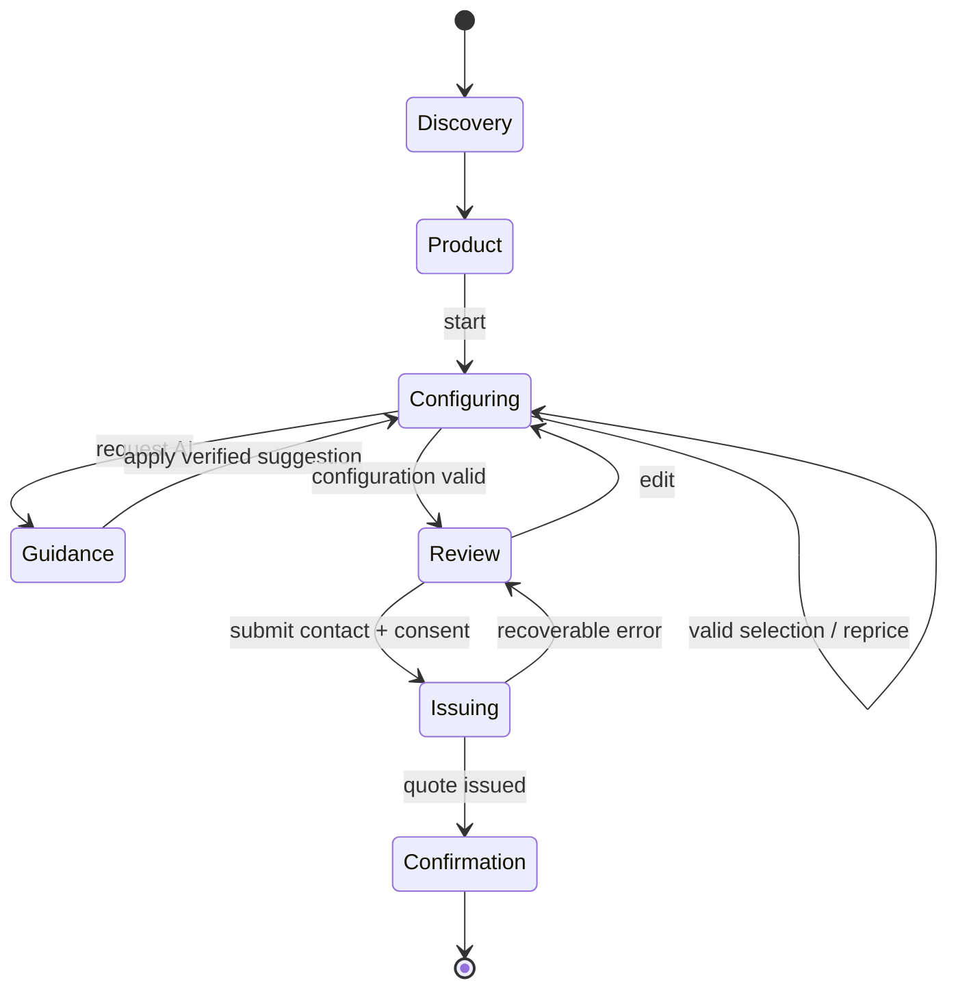

# UX Specification

**Status:** Proposed normative specification  
**Principle:** Price clarity and completion of the quote journey must never depend on 3D or AI availability.

## 1. Information architecture and navigation

Public navigation contains the organization brand/home link, catalog, “Start an estimate”, locale switcher, and legal/footer links. The configurator uses a focused flow with a close/back action and no competing marketing navigation. Admin navigation is role-filtered and uses persistent desktop sidebar plus mobile drawer.

## 2. Screen inventory

| ID | Screen | Primary purpose | Primary action |
|---|---|---|---|
| PUB-01 | Landing | value proposition and supported categories | Start an estimate |
| PUB-02 | Category catalog | compare published products in a category | View product |
| PUB-03 | Product detail | explain product, starting price and assumptions | Configure |
| CFG-01 | Configurator | choose variant, dimensions and options with live preview | Continue to review |
| CFG-02 | AI guidance panel | explain choices and grounded alternatives | Apply verified suggestion |
| QTE-01 | Review and contact | confirm selections, price, identity and consent | Generate quote |
| QTE-02 | Quote confirmation | show quote number, expiry and next steps | Download PDF |
| PUB-04 | Public quote | reopen an unexpired tokenized quote | Download PDF/contact |
| SYS-01 | Generic error | recover from unexpected public failure | Retry/go to catalog |
| ADM-01 | Sign in | authenticate staff | Send sign-in link/sign in |
| ADM-02 | Dashboard | operational summary and pending work | Open relevant area |
| ADM-03 | Catalog list | filter categories/products by state | Create/edit |
| ADM-04 | Product editor | edit metadata, variants, options and publication | Save draft/publish |
| ADM-05 | Viewer editor | upload/select model and author hotspots/mappings | Validate preview |
| ADM-06 | Pricing rules | edit ordered rules and run simulations | Publish revision |
| ADM-07 | Assets | inspect upload/processing/usage | Upload/archive |
| ADM-08 | Quotes | search, filter and inspect quote snapshots | Update status/contact |
| ADM-09 | Customers | find consented customers and history | Open quote/contact |
| ADM-10 | Settings | brand, locale, tax, legal text and users | Save authorized change |
| ADM-11 | Audit log | investigate privileged actions | Filter/export |

## 3. Public user flow

### Configurator step order

1. Variant and size/dimensions.
2. Required structural/material choices.
3. Optional features grouped by customer outcome.
4. Delivery/site inputs required by pricing.
5. Review, assumptions and contact.

Step order is product data, but dependencies may reveal a later choice only after prerequisites are satisfied. Hidden choices are never silently retained; the user is warned and confirms removal when a prerequisite change invalidates selections.

## 4. Configurator wireframe descriptions

### Desktop (≥1024 px)

- Top bar: product identity, step progress, save status, exit.
- Left rail (28–34%): current step heading, concise guidance, option controls, validation and Previous/Next.
- Center (remaining flexible area): Object Viewer or static fallback, reset/view controls and hotspot callout.
- Right sticky summary (280–360 px): current total, delta after last change, item groups, budget indicator and review action.
- AI guidance opens as a non-modal side sheet and never obscures the total or required controls.

### Mobile (<768 px)

- Compact top bar and step progress.
- Viewer/fallback occupies at most 38vh and can collapse to preserve form space.
- Step controls appear below the viewer; a sticky bottom bar shows total and Continue.
- Price breakdown and AI guidance open as accessible bottom sheets with focus trapping and a visible close action.
- No essential action relies on hover, two-finger gestures or precision pointing.

### Review and confirmation

- Review groups selections by configuration step and distinguishes included, optional, labor, delivery, discount and tax lines.
- Contact fields are separate from consent checkboxes. Marketing consent is optional and distinct from quote/follow-up consent.
- Confirmation uses a stable quote number, expiry, total, download button and business contact expectations. It does not imply contractual acceptance.

## 5. Admin wireframe descriptions

- Lists use a page title, role-appropriate primary action, filter row, sortable table/card fallback, pagination and persistent query parameters.
- Editors use tabs only for independent sections; validation summary links to invalid fields across tabs.
- Publication uses a review dialog showing changed fields, validation results, effective timestamp and irreversible revision creation.
- Pricing simulation is a split view: scenario inputs left, ordered rule trace and line items right. A failed or skipped rule explains why.
- Hotspot editor provides model preview, hotspot list, selected marker properties, numeric coordinate alternative, keyboard nudge and textual fallback order.
- Destructive actions use archive by default. Permanent deletion is available only when no immutable quote/audit reference exists.

## 6. Component interaction patterns

- Radio group: one required choice; selected state includes text, not color alone.
- Checkbox/card: independent optional choice with explicit price delta.
- Select/combobox: ≥8 choices or searchable catalog reference.
- Numeric dimension: unit displayed adjacent, min/max/step in helper text, normalized server value returned.
- Price: locale-formatted, currency always discernible, `aria-live="polite"` announcement after settled authoritative update.
- Hotspot: canvas marker paired with a keyboard-accessible ordered list using the same label/detail.
- Suggestion: “Apply” remains disabled until referenced selection and server-verified price effect are valid.

## 7. State catalog

### Loading states

| Context | State |
|---|---|
| Page navigation | preserve layout; skeleton only for content whose shape is known |
| Initial configuration | disable form once, show status and cancel/back after 10 s |
| Repricing | retain prior total labeled “Updating”; debounce visual changes 150 ms, server request immediately after stable input |
| Model | canvas placeholder with progress when length known; after 900 ms show descriptive loading status |
| AI | cancellable progressive status; no fabricated streaming text before validated result |
| PDF | queued/generating status with retry-safe polling; user may leave and reopen quote |
| Upload | per-file progress, checksum/processing phases and resumable retry where provider supports it |

### Empty states

- No published products: explain temporary unavailability and show organization contact, not a blank grid.
- No optional choices: state that the current product has no options for this step.
- No AI recommendation: state the current configuration already matches constraints or guidance is unavailable.
- No admin records: explain the resource and expose create action only when authorized.
- No quote results: preserve filters and offer clear/reset filters.
- No hotspots: viewer remains usable; admin sees “Add first hotspot”.

### Error states

- Inline validation appears beside the field and in a focusable summary on submit.
- Dependency conflict names the conflicting choices and offers the smallest reversible resolution.
- Price mismatch replaces the provisional total with server truth and explains that pricing was refreshed.
- Model error offers Retry, static fallback and textual hotspot list; it never blocks Next.
- AI error offers Retry once and Continue without guidance.
- Quote issue error preserves entered contact details except sensitive/transient tokens and uses the same idempotency key on retry.
- Expired public quote explains expiry and links to start a new configuration; it does not expose quote content.
- Unauthorized admin access returns a role-appropriate message without revealing resource existence.
- Unexpected errors display a correlation ID safe to share with support.

### Success and unsaved states

- Saved changes show a timestamped, non-blocking confirmation.
- Unsaved admin navigation triggers a leave/stay guard.
- Publication confirmation includes revision and effective time.
- Applied AI suggestions show exactly which selections changed and permit Undo until another edit.

## 8. Accessibility requirements

- Logical landmarks and one `h1`; focus order follows visual order.
- Minimum 44×44 CSS px touch targets and visible focus indicators.
- Dialogs/sheets trap and restore focus; Escape closes only dismissible surfaces.
- Form errors are programmatically associated; status changes use appropriate live regions without chatter.
- Motion respects `prefers-reduced-motion`; auto-rotation defaults off when reduced motion is requested.
- Viewer supports arrow-key rotation, `+`/`-` zoom, reset, hotspot list navigation, text alternatives and static fallback.
- Charts are not required for MVP; all administrative metrics have textual values.
- PDF uses tagged headings, table headers, reading order, sufficient contrast and selectable text.

## 9. Responsive and content requirements

- Breakpoints are content-driven; supported widths are 320, 360, 768, 1024 and 1440 px.
- French expansion must fit at 130% of English label length without truncating required meaning.
- Legal assumptions use plain language and are visible before quote issue.
- Starting prices use “from” only when a valid published default configuration produces that value.
- AI is consistently labeled “AI guidance”; pricing and feasibility claims link to deterministic lines or explicit assumptions.

## 10. UX acceptance tests

- Complete the public flow with keyboard only at 360×800 and 1440×900.
- Complete it with model, AI and PDF worker failures injected independently.
- Change a prerequisite and verify invalid dependent selections require an explicit resolution.
- Navigate away from a dirty admin editor and verify data-loss prevention.
- Publish a pricing revision only after successful simulations and validation.
- Validate English/French layout, reduced motion, 200% zoom, screen-reader announcements and contrast.
