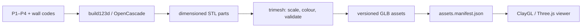

# Mobup CAD display asset pipeline

The studio structure is authored as parametric CAD and rendered in the browser
as a compact GLB. The browser never downloads a Python runtime or starts a CAD
kernel.

## Pipeline

`scripts/generate-studio-cad.py` is the authoring command. It keeps the
viewer coordinate convention (`x = width`, `y = height`, `z = depth`) and
exports four exact catalogue variants:

| Asset | Configuration | Bounds (m) |
| --- | --- | --- |
| `p1-m1` | P1 + M1 | 1.47 × 3.02 × 3.22 |
| `p2-m7` | P2 + M7 | 2.72 × 3.02 × 3.22 |
| `p3-m8` | P3 + M8 | 3.97 × 3.02 × 3.22 |
| `p4-m1-m8` | P4 + M1 + M8 | 5.22 × 3.02 × 3.22 |

The extra 220 mm in the bounds is the fascia/edge tolerance around the
5,000/3,000/2,800 mm studio envelope. All dimensions are authored as integer
millimetres, then converted to metres once for GLB export.

## Validation and CI

`scripts/check-studio-cad.py` verifies that all four GLBs exist, contain only
triangle meshes, have watertight connected components and remain within a 6%
dimension tolerance. `pnpm cad:generate` regenerates the committed assets and
`pnpm cad:check` validates them without build123d. The `Studio CAD assets`
workflow regenerates into a temporary directory on pull requests and pushes;
this catches drift in the authoring toolchain before publication.

The runtime manifest records each generated file as `GENERATED_CAD`, including
its byte count and SHA-256. `pnpm check:studio-assets` enforces local paths,
provenance, checksums and the 6 MB critical transfer budget.

## Runtime selection

`apps/web/app/viewer/studio-cad-assets.ts` resolves an asset only when the base
code and ordered wall codes exactly match a generated variant. ClayGL is the
default renderer and Three.js remains the explicit fallback. When a GLB loads,
the matching procedural foundation/roof/walls groups are hidden so they cannot
z-fight or intersect; accessories, analysis overlays and the exterior context
remain owned by the viewer. If a GLB is missing or unsupported, the validated
procedural structure stays visible and the quote flow remains usable.

Generated CAD assets are presentation geometry, not a manufacturing or
structural certificate. Any production fabrication dimensions must be approved
against the manufacturer's source drawings.
