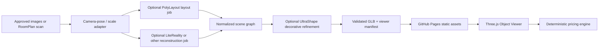
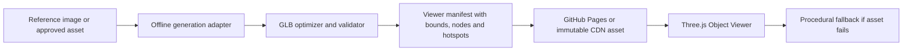

# 3D generation provider evaluation

**Status:** Informative decision record  
**Date:** 2026-08-11  
**Scope:** Public, static GitHub Pages demo with an interactive Three.js viewer and no paid GPU runtime. This record also evaluates optional external reconstruction providers.

## Decision summary

The browser must not run a large image-to-3D or world-generation model. Generation is an offline or external production step that emits optimized GLB assets and a provider-neutral viewer manifest. GitHub Pages serves those immutable assets; the viewer keeps the current procedural scene as a deterministic fallback.

The three references are useful at different layers, but none is a drop-in replacement for the web renderer:

| Reference | What it is | What we reuse | Why it is not embedded in GitHub Pages |
|---|---|---|---|
| [DAAAM](https://github.com/MIT-SPARK/DAAAM) | Real-time semantic, spatio-temporal robot mapping and dynamic scene graphs | Stable object identities, semantic scene graph, temporal observation concepts | It targets Ubuntu/ROS 2/Hydra and documents an NVIDIA GPU with 24 GB+ VRAM; it is not an image-to-GLB asset generator. |
| [SceneGen](https://github.com/Mengmouxu/SceneGen) | Single-image 3D scene generation with GLB export and a Gradio demo | Offline image-to-scene job contract and GLB output boundary | Inference requires an NVIDIA GPU with at least 16 GB VRAM, CUDA submodules and large checkpoints; it cannot execute in a static visitor browser. |
| [Hunyuan3D WorldClaw](https://tencent-hunyuan.github.io/Hunyuan3D-WorldClaw/) | Agentic coarse-to-fine open-world generation | Scene specification, global terrain, regional assets, placement/refinement loop | The associated research pipeline uses multiple GPU workers and Blender. The public project page is a reference/demo, not a static browser SDK. |
| [LiteReality-Agent](https://github.com/LiteReality/LiteReality-Agent) | Agentic indoor scene reconstruction from RGB/depth frames and an Apple RoomPlan scan | A staged reconstruction job, semantic scene graph, articulated asset boundary and final `Room.glb` package | It expects a RoomPlan `room.usdz` plus RGB/depth captures, Blender and either a local 24 GB+ GPU or hosted Modal/TRELLIS/GroundingDINO. It is an external job runner, not a browser library, and it targets indoor rooms rather than a single outdoor pergola photograph. |
| [PolyLayout](https://github.com/ghanning/PolyLayout) | Multi-room Manhattan layout estimation from posed perspective images | Early structural geometry, shared orientation and floor/ceiling scale hypotheses | It is a Python/PyTorch research pipeline that needs camera poses and downloaded weights. It predicts room layout polygons; it does not reconstruct furniture, materials or garden/pergola assets and cannot run in a static visitor browser. |
| [UltraShape-1.0](https://github.com/PKU-YuanGroup/UltraShape-1.0) | Two-stage geometric refinement from an image and coarse mesh | Offline refinement of decorative furniture, plants and accessories before GLB publication | It requires a Python/PyTorch/CUDA environment and a coarse mesh; it is not a browser runtime, terrain engine or metrically authoritative CAD generator. |

## Licensing gate

The Hunyuan references require a legal review before commercial use. The official [HunyuanWorld-1.0 license](https://github.com/Tencent-Hunyuan/HunyuanWorld-1.0/blob/main/LICENSE) and [Hunyuan3D-2.1 license](https://github.com/Tencent-Hunyuan/Hunyuan3D-2.1/blob/main/LICENSE) expressly exclude the European Union, United Kingdom and South Korea. The target market includes French-speaking customers, so Hunyuan model weights, model derivatives and generated outputs are not approved dependencies for the product without written legal clearance. This document is technical guidance, not legal advice.

SceneGen is published under an MIT license in its repository and DAAAM under BSD-3-Clause, but their model checkpoints, datasets and third-party dependencies still require separate provenance checks before redistribution.

LiteReality-Agent is Apache-2.0 in its repository. PolyLayout is Apache-2.0 and publishes inference code and pre-trained weights links. Those repository licenses do not automatically grant permission to redistribute every checkpoint, dataset, Blender asset or generated derivative; each production asset still needs a provenance record. Their runtime dependencies also remain outside the GitHub Pages deployment.

## Reconstruction-provider boundary

The product must expose a provider-neutral boundary so the current static demo and a future hosted reconstruction service share the same viewer contract:



The adapter contract is deliberately provider-neutral:

```ts
type ReconstructionInput = {
  sourceImages: Array<{ url: string; camera?: CameraPose }>;
  roomPlanUrl?: string;
  scaleAnchor?: { estimatedMeters: number; realMeters: number };
  target: "indoor-room" | "outdoor-estimate";
};

type ScenePackage = {
  glbUrl: string;
  manifestUrl: string;
  units: "meter";
  coordinateSystem: "y-up-right-handed";
  bounds: { width: number; depth: number; height: number };
  confidence: number;
  provenance: { provider: string; sourceRevision: string; license: string };
};
```

The browser consumes only `ScenePackage`. It never receives provider credentials, starts a GPU job, or assumes that a reconstructed scene is metrically accurate. A missing provider result falls back to the current procedural scene and preserves pricing. A professional quote requires a human-confirmed scale anchor and an explicit measurement disclaimer.

### Recommended provider roles

- **Current static demo:** procedural Three.js scene plus approved, optimized GLB/Poly Haven assets. This is the only path that is fully free and self-contained on GitHub Pages.
- **PolyLayout (research adapter):** optional pre-processing for indoor room geometry when the input contains reliable camera poses. Its JSON layout may produce an early wireframe, but it is not an outdoor pergola estimator and must not be presented as a final reconstruction.
- **LiteReality-Agent (hosted/offline adapter):** optional reconstruction provider when the customer can supply a compatible RoomPlan/depth capture. Its `Room.glb` is normalized and published as an immutable asset before the viewer loads it. It is not a replacement for the current browser scene and cannot be invoked from GitHub Pages alone.
- **UltraShape-1.0 (offline refinement adapter):** optional post-processing for a coarse decorative GLB. It can improve silhouettes and geometric detail for furniture, plants and accessories, but its output remains visual-only. The studio CAD shell, dimensions and pricing stay authoritative and are never replaced by an AI-refined mesh. See [the UltraShape integration contract](./ULTRASHAPE_INTEGRATION).

No provider is approved to compute a price directly. Providers produce geometry and confidence metadata; the deterministic pricing engine remains the sole authority for totals.

## Architecture to implement



### Generation adapter

The adapter is provider-neutral and produces:

- `asset.glb` with PBR materials;
- a poster image;
- normalized bounds, units and coordinate system;
- semantic node keys such as `structure`, `roof`, `water`, `planting`, `lighting`;
- a checksum, byte size, triangle count and texture budget;
- a viewer manifest that contains camera presets, capabilities and hotspots.

SceneGen can be used as an offline implementation of this adapter after a GPU run. UltraShape can be used after a coarse mesh exists to refine decorative instances; it is tracked by `apps/web/app/studio/ultrashape-assets.manifest.json` and resolved with a local fallback. WorldClaw's three-stage contract is the design reference for future scene batches: plan the scene, build terrain/regions, then generate and refine instance assets. DAAAM's scene-graph ideas can inform stable node identities, but no ROS, Hydra or robotics code belongs in the web application.

### Browser runtime

The web application should only:

1. fetch a published GLB/GLTF from an immutable URL;
2. validate its manifest and byte budget;
3. load it with pinned GLTF/Draco/Meshopt decoders;
4. frame the bounds and apply configured material/visibility actions;
5. release GPU resources when the product changes;
6. fall back to the procedural preview when loading fails or WebGL is unavailable.

No prompt, image upload or model inference is sent to the browser in the static demo.

## Immediate path that preserves zero hosting cost

For the first visible realism upgrade, use legally reusable CC0 environment assets and PBR materials, then commit only optimized derivatives that meet the viewer budgets. [Poly Haven](https://polyhaven.com/) publishes CC0 models, HDRIs and textures and is suitable for lighting and environment dressing; each asset still needs a checked provenance entry in `docs/assets/IMAGE_SOURCES.md`.

The initial asset pack should contain one hero pergola, one pool shell/water surface and one garden environment, each below the existing 5 MB transfer target (10 MB hard gate). AI-generated assets can replace these later without changing the viewer contract.

## Implementation gates

The next viewer implementation is complete only when:

- a compliant GLB is loaded in the public static build;
- a missing, malformed or oversized GLB shows a useful fallback and preserves pricing;
- switching Pergola, Pool and Garden releases the previous GPU resources;
- the asset manifest exposes stable semantic keys and camera bounds;
- no Hunyuan model, restricted checkpoint or GPU service is added to the repository;
- the generated asset has a source, license, checksum and optimization report.
