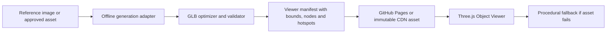

# 3D generation provider evaluation

**Status:** Informative decision record  
**Date:** 2026-08-11  
**Scope:** Public, static GitHub Pages demo with an interactive Three.js viewer and no paid GPU runtime.

## Decision summary

The browser must not run a large image-to-3D or world-generation model. Generation is an offline or external production step that emits optimized GLB assets and a provider-neutral viewer manifest. GitHub Pages serves those immutable assets; the viewer keeps the current procedural scene as a deterministic fallback.

The three references are useful at different layers, but none is a drop-in replacement for the web renderer:

| Reference | What it is | What we reuse | Why it is not embedded in GitHub Pages |
|---|---|---|---|
| [DAAAM](https://github.com/MIT-SPARK/DAAAM) | Real-time semantic, spatio-temporal robot mapping and dynamic scene graphs | Stable object identities, semantic scene graph, temporal observation concepts | It targets Ubuntu/ROS 2/Hydra and documents an NVIDIA GPU with 24 GB+ VRAM; it is not an image-to-GLB asset generator. |
| [SceneGen](https://github.com/Mengmouxu/SceneGen) | Single-image 3D scene generation with GLB export and a Gradio demo | Offline image-to-scene job contract and GLB output boundary | Inference requires an NVIDIA GPU with at least 16 GB VRAM, CUDA submodules and large checkpoints; it cannot execute in a static visitor browser. |
| [Hunyuan3D WorldClaw](https://tencent-hunyuan.github.io/Hunyuan3D-WorldClaw/) | Agentic coarse-to-fine open-world generation | Scene specification, global terrain, regional assets, placement/refinement loop | The associated research pipeline uses multiple GPU workers and Blender. The public project page is a reference/demo, not a static browser SDK. |

## Licensing gate

The Hunyuan references require a legal review before commercial use. The official [HunyuanWorld-1.0 license](https://github.com/Tencent-Hunyuan/HunyuanWorld-1.0/blob/main/LICENSE) and [Hunyuan3D-2.1 license](https://github.com/Tencent-Hunyuan/Hunyuan3D-2.1/blob/main/LICENSE) expressly exclude the European Union, United Kingdom and South Korea. The target market includes French-speaking customers, so Hunyuan model weights, model derivatives and generated outputs are not approved dependencies for the product without written legal clearance. This document is technical guidance, not legal advice.

SceneGen is published under an MIT license in its repository and DAAAM under BSD-3-Clause, but their model checkpoints, datasets and third-party dependencies still require separate provenance checks before redistribution.

## Architecture to implement

### Generation adapter

The adapter is provider-neutral and produces:

- `asset.glb` with PBR materials;
- a poster image;
- normalized bounds, units and coordinate system;
- semantic node keys such as `structure`, `roof`, `water`, `planting`, `lighting`;
- a checksum, byte size, triangle count and texture budget;
- a viewer manifest that contains camera presets, capabilities and hotspots.

SceneGen can be used as an offline implementation of this adapter after a GPU run. WorldClaw's three-stage contract is the design reference for future scene batches: plan the scene, build terrain/regions, then generate and refine instance assets. DAAAM's scene-graph ideas can inform stable node identities, but no ROS, Hydra or robotics code belongs in the web application.

### Browser runtime

The web application should only:

1. fetch a published GLB/GLTF from an immutable URL;
2. validate its manifest and byte budget;
3. load it with pinned GLTF/Draco/Meshopt decoders;
4. frame the bounds and apply configured material/visibility actions;
5. release GPU resources when the product changes;
6. fall back to the procedural preview when loading fails or WebGL is unavailable.

No prompt, image upload or model inference is sent to the browser in the static demo.

## Immediate path that preserves zero hosting cost

For the first visible realism upgrade, use legally reusable CC0 environment assets and PBR materials, then commit only optimized derivatives that meet the viewer budgets. [Poly Haven](https://polyhaven.com/) publishes CC0 models, HDRIs and textures and is suitable for lighting and environment dressing; each asset still needs a checked provenance entry in `docs/assets/IMAGE_SOURCES.md`.

The initial asset pack should contain one hero pergola, one pool shell/water surface and one garden environment, each below the existing 5 MB transfer target (10 MB hard gate). AI-generated assets can replace these later without changing the viewer contract.

## Implementation gates

The next viewer implementation is complete only when:

- a compliant GLB is loaded in the public static build;
- a missing, malformed or oversized GLB shows a useful fallback and preserves pricing;
- switching Pergola, Pool and Garden releases the previous GPU resources;
- the asset manifest exposes stable semantic keys and camera bounds;
- no Hunyuan model, restricted checkpoint or GPU service is added to the repository;
- the generated asset has a source, license, checksum and optimization report.
