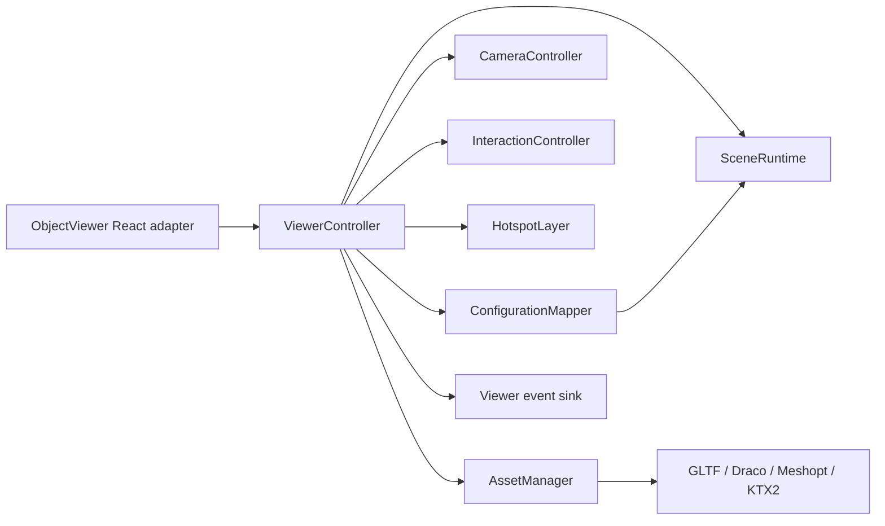
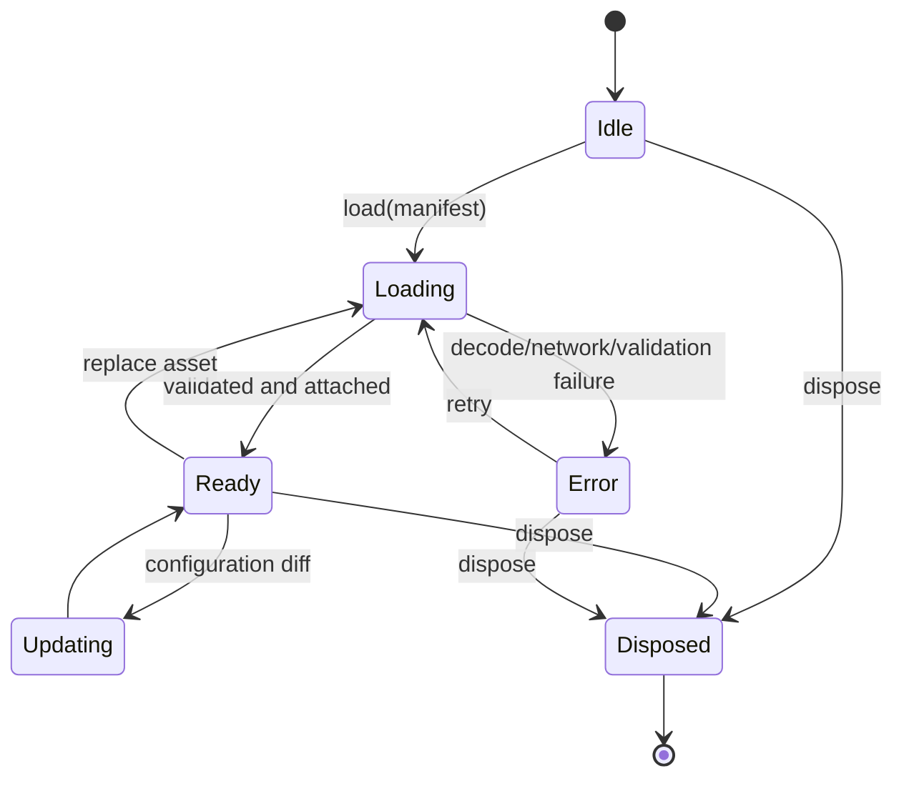

# Generic Object Viewer Specification

**Status:** Proposed normative specification  
**Reference reviewed:** public `thebuggeddev/anatomy` repository at the revision available during design on 2026-08-05. It is a technical reference only; no source, model, visual identity, content or domain terminology is to be copied.

## 1. Purpose and boundary

`viewer-engine` renders a generic configured object from declarative data. It knows assets, scene nodes, transforms, materials, visibility, camera presets and hotspots. It does not know categories, products, prices, AI, “organs”, pools or any other business concept.

### Inputs

- Asset manifest with primary GLB/GLTF URL, poster, checksum, byte size, compression metadata and bounds.
- Viewer manifest with camera constraints, environment preset, node mappings, variants and hotspots.
- Current serializable `ViewerConfiguration`: selected variant ID, option IDs and dimension values already validated by the configurator.
- Callbacks for ready, progress, error, selection, camera and telemetry events.

### Outputs

- A canvas and DOM-accessible control/hotspot layer.
- Stable typed events; no domain mutation.
- Screenshot capability for quote/admin preview where supported.

## 2. Reference audit

### Reusable concepts and architectural ideas

- Lazy client-only viewer construction and deterministic disposal on unmount.
- Separate asset manager, hotspot layer and scene controller.
- GLTF loading, normalized bounding-box fit and optional embedded animation playback.
- Explicit texture/material/geometry cleanup and bounded warm cache.
- Render-on-demand with dirty/busy tracking; pause using page visibility and intersection observers.
- Device-aware pixel ratio, resize observer, orbit limits and progressive loading feedback.
- 3D marker anchoring, screen-space picking, occlusion/facing treatment and imperative callout positioning to avoid React re-renders.
- Keyboard controls, reduced-motion behavior and a textual hotspot equivalent.

### Concepts that must be redesigned or generalized

- `AnatomyViewer`, `AnatomyAssetManager`, `LoadedOrgan`, `OrganViewer`, `Hotspot` data and organ-specific copy become generic interfaces.
- Hard-coded camera, plinth, lights, accent glow, medical materials, model rotation and fit values become validated manifest presets with safe defaults.
- Tool names such as isolate, cross-section and layers are optional capabilities declared per asset, not universal viewer controls.
- Nearest-vertex hotspot snapping is an authoring aid, not an implicit runtime correction; published anchors are explicit node-local coordinates plus optional surface binding.
- Direct model URLs and domain data modules become asset records and revisioned viewer manifests.
- Monolithic scene controller methods become lifecycle, asset, scene, interaction and annotation units with contract tests.

### What is never reused

Anatomy models/images, anatomy entity definitions, names, medical descriptions, icons, poetic copy, CSS identity, layout, product navigation and learning-card concepts.

## 3. Component model

| Unit | Responsibility |
|---|---|
| React adapter | mount, prop diff, fallback, event bridge, dispose |
| ViewerController | public lifecycle API and orchestration |
| AssetManager | validate/load/cache/release assets and decoder setup |
| SceneRuntime | renderer, scene, lighting/environment and frame scheduling |
| CameraController | frame bounds, orbit, presets, reset and keyboard |
| ConfigurationMapper | map generic selection conditions to node/material actions |
| HotspotLayer | render/select/focus annotations and expose screen positions |
| CapabilityRegistry | enable supported controls only |
| Telemetry sink | emit non-PII timing, failure and capability events |

## 4. Manifest design

The versioned viewer manifest contains:

- `schemaVersion`, `assetId`, `assetRevision`, `coordinateSystem`, `units`.
- `scene`: background/environment preset, exposure, optional ground/contact shadow.
- `camera`: default position/target or auto-frame, FOV, min/max distance, allowed pan/zoom/rotation.
- `nodes`: stable semantic mapping keys to one or more GLTF node names.
- `actions`: condition tree over variant/option/dimension facts and actions: `setVisible`, `setMaterialVariant`, `setColor`, `setTransform`, `playClip`.
- `hotspots`: stable ID, localized label/detail, anchor (`nodeKey`, local position, optional normal), visibility condition and focus camera preset.
- `capabilities`: orbit, zoom, reset, autoRotate, explode, section, screenshot; unsupported capabilities are absent.

Unknown schema versions fail closed to fallback. Missing optional nodes produce an admin validation error before publication; runtime logs the mismatch and ignores only the affected cosmetic mapping.

## 5. Lifecycle

Each load has a request token; completion from a superseded load is ignored and released. Disposal cancels animation frames, fetch/decode where possible, observers, listeners and tweens; stops/uncaches mixers; detaches scene nodes; disposes owned geometries, materials, textures, render targets and renderer; clears caches.

## 6. Rendering and performance

- WebGL2 is preferred; unsupported browsers receive poster fallback.
- Pixel ratio cap: 2 desktop, 1.5 constrained/mobile by default; configuration may lower but not exceed 2 without an approved performance exception.
- Render only while dirty, interacting, animating or transitioning; pause outside viewport and when the document is hidden.
- Asset authoring budget per primary model: ≤5 MB compressed transfer target, ≤10 MB hard gate without waiver, ≤250k triangles, ≤4k texture dimension, ≤8 simultaneous material textures. Budgets are validated during asset processing.
- Draco/Meshopt/KTX2 support is determined by the asset pipeline; decoder files are version-pinned and cached.
- Model switch memory test: 20 alternating loads must settle within 15% of the post-warm baseline after garbage collection in the controlled benchmark.
- Viewer JS is excluded from initial public route bundle and loaded on intent/viewport proximity.

## 7. Interaction and accessibility

- Pointer: drag orbit, wheel/pinch zoom within constraints, click/tap hotspot with drag threshold.
- Keyboard: arrows rotate, `+`/`-` zoom, `0` reset; hotspot DOM list follows standard tab/Enter behavior.
- Touch targets are ≥44 px; screen-space picking radius is device appropriate.
- Auto-rotate pauses after interaction and while a hotspot is selected; it is disabled for reduced motion.
- Canvas has a concise localized label and instructions. Every hotspot has an ordered DOM equivalent; selecting either path synchronizes the callout.
- Focus is never placed inside canvas-only primitives. Fallback poster has meaningful alt text and preserves all textual controls.

## 8. Configuration mapping rules

- Mapping operates on normalized facts and computes a declarative target state before mutating the scene.
- Application is idempotent and based on diff from the previous target state.
- Pricing effects never live in viewer mappings.
- A business option can map to zero or many viewer actions; lack of visualization does not invalidate a priced option.
- Conflicting actions are rejected at publication using priority/order validation; runtime uses deterministic manifest order only as a safety fallback.

## 9. Error and telemetry catalog

Typed errors: `UNSUPPORTED_BROWSER`, `MANIFEST_INVALID`, `ASSET_NETWORK`, `ASSET_INTEGRITY`, `ASSET_DECODE`, `NODE_MAPPING`, `RENDERER_CONTEXT_LOST`, `SCREENSHOT_UNAVAILABLE`, `DISPOSED`.

Telemetry captures asset/revision, timing buckets, transfer size, device capability class, fallback/error code and memory benchmark results. It excludes customer identity, configuration free text, model URLs containing credentials and raw exception secrets.

## 10. Verification

- Unit: manifest parsing, configuration condition evaluation, diff/idempotency and capability registry.
- Contract: adapter lifecycle and provider-neutral event payloads.
- Integration: load minimal GLB, mapping visibility/material, hotspot synchronization, context loss and replacement cancellation.
- Browser: orbit/zoom/reset, keyboard, reduced motion, poster fallback, responsive sizing and disposal.
- Performance: bundle budget, compliant asset ready time, sustained frame pacing and repeated-switch memory.
- Publication: reject unsupported extension, oversized asset, missing node, duplicate hotspot, invalid anchor, capability mismatch and mapping cycle/conflict.

## 11. Current direct-estimator slice

The first production-oriented slice is exposed directly at `/` rather than behind a catalogue workflow:

- local reference assets for pergola, pool and garden scenes;
- the supplied cedar-pergola reference drives the default 3D material/scene brief without being used as a canvas background;
- a named procedural factory with `root.userData.sculptRuntime` metadata inspired by the staged `img2threejs` output contract;
- neutral studio canvas with a procedural Three.js scene; reference photographs are limited to product-selector thumbnails;
- a locally cached, CC0 Poly Haven `Lapa` HDRI supplies environment reflections/ambient context without becoming a distracting flat background;
- the garden scene lazy-loads one real Poly Haven painted-wooden-bench GLTF prop (1K maps, under 2 MB) and keeps the procedural scene as its deterministic fallback;
- English/French copy toggle (English is the default for Fiverr-facing traffic);
- orbit, zoom, reset, auto-orbit and measurement controls;
- inline dimensions, finishes, roof and add-on selections;
- live estimate lines for base product, footprint, options, labour, delivery, volume discount and VAT;
- a quote-ready state that is intentionally local until customer, delivery-zone and PDF endpoints are wired.

The browser surface is an estimate preview, not a claim of photogrammetric accuracy. A production image-to-GLB provider remains behind the provider-neutral asset pipeline, while `img2threejs` is reserved for deterministic procedural reconstruction when the reference is suitable.
