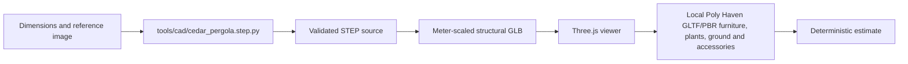

# text-to-cad evaluation

**Status:** Accepted as an offline structural asset workflow  
**Date:** 2026-08-12  
**Scope:** Parametric pergola structure for the static Three.js estimator

## Decision

[earthtojake/text-to-cad](https://github.com/earthtojake/text-to-cad) is useful for the part of the product that must be dimensionally explicit: posts, beams, deck boards, fascia and roof rafters. Its CAD skill is STEP-first and supports secondary native GLB export, so it provides a cleaner structural source than hand-authored browser primitives.

It is not a replacement for a photogrammetry or image-to-world model. The repository describes a library of agent skills for CAD/CAE/CAM; its primary output is a validated parametric STEP model, with STL/3MF/GLB as derived exports. It does not infer a complete garden from one photograph, generate realistic planting, or provide the final PBR/lighting treatment. See the [CAD skill](https://github.com/earthtojake/text-to-cad/blob/main/skills/cad/SKILL.md) and [supported exports](https://github.com/earthtojake/text-to-cad/blob/main/skills/cad/references/supported-exports.md).

## Pipeline

The committed source uses millimetres and an explicit width/depth/height contract. The web loader scales the exported GLB to the current estimator dimensions, applies the local cedar texture, and keeps the decorative layers separate. The pergola scene now loads local Poly Haven GLTF assets for furniture, potted plants, grass cover, lanterns and a fire pit, plus a small generated GLB patio carrier with Poly Haven cobblestone diffuse/normal/roughness maps. If a CAD asset cannot be loaded, the procedural structure remains visible.

## What this improves

- structural proportions are driven by one parametric source;
- deck boards and roof rafters are named and dimensionally consistent;
- the viewer receives an ordinary glTF 2.0 asset, without CAD runtime dependencies;
- pricing dimensions can drive the CAD structure without regenerating code in the browser;
- the generated asset is small enough for the static viewer budget.

## What it does not solve

- no single-image photogrammetric reconstruction;
- no realistic foliage or outdoor context by itself;
- no manufacturing certification, load calculation or engineering sign-off;
- no browser-side text-to-CAD generation;
- no automatic measurement of a customer property from a photograph.

The generated GLB is a visual/product-estimate asset, not a construction document. The scale anchor and final site measurements remain mandatory before a professional quote.

## Verification record

- Source: `tools/cad/cedar_pergola.step.py`.
- STEP generation: completed with the text-to-cad `scripts/gen` workflow.
- Native GLB export: completed with `scripts/export --glb`.
- GLB bounds: approximately `6.4 m × 5.097 m × 2.83 m` before viewer scaling.
- Browser: GLB loader is optional and falls back to the procedural structure on failure.
- Repository checks: web typecheck, lint, 13 tests and static build passed; the generated `out/assets/models/cad/cedar_pergola.glb` was present.
