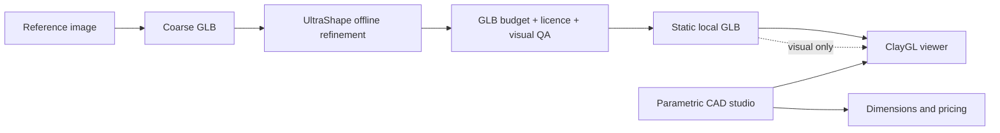

# UltraShape integration

## Decision

UltraShape-1.0 is adopted as an **offline, optional refinement provider** for
visual environment assets. It is not a browser-side 3D engine and it does not
replace the parametric CAD geometry used by the estimator.

UltraShape refines a coarse mesh using a two-stage geometric generation
pipeline. Its input contract is therefore an image plus a coarse mesh; it is
not a standalone, zero-dependency image-to-3D runtime.

## Why this fits the studio

The product needs a credible first impression while preserving exact module
dimensions for quotes. UltraShape can improve the silhouette and surface detail
of furniture, plants and accessories. The CAD model remains authoritative for
the studio shell, glazing, cladding, roof and terrace footprint.

## Runtime contract

`apps/web/app/studio/ultrashape-assets.manifest.json` records the input image,
coarse mesh, fallback asset, expected output path and publication status. The
viewer resolves a published output through
`apps/web/app/viewer/ultrashape-assets.ts` and otherwise uses the fallback.

This makes the integration safe for GitHub Pages:

- no Python, CUDA, checkpoint or remote inference request is shipped to the
  browser;
- every current context has a local fallback;
- generated files are same-origin static assets;
- a visual asset can never change the quote calculation.

## Acceptance gates for each output

An output can move from `pending` to `published` only when:

1. the refined asset remains a decorative or presentation-only object;
2. dimensions and placement are checked against the scene in metres;
3. the GLB and its textures fit the per-asset byte budget;
4. source, checkpoint and input-asset terms are reviewed for commercial use;
5. the checksum and output licence are recorded in the manifest;
6. ClayGL and the explicit Three.js fallback both load the file without a new
   console error;
7. the quote, module validation and PDF output are unchanged.

## Current rollout

The first rollout keeps all entries in `pending` so the public demo remains
deterministic while the GPU generation step is performed outside the web build.
The garden, pool and terrace scenes already use local PBR furniture, plants and
accessories as their fallback, so adding a published UltraShape file is a
bounded manifest change rather than a renderer rewrite.

See the [upstream UltraShape repository](https://github.com/PKU-YuanGroup/UltraShape-1.0)
and the `tools/ultrashape/README.md` asset refinement runbook for the technical
workflow.
